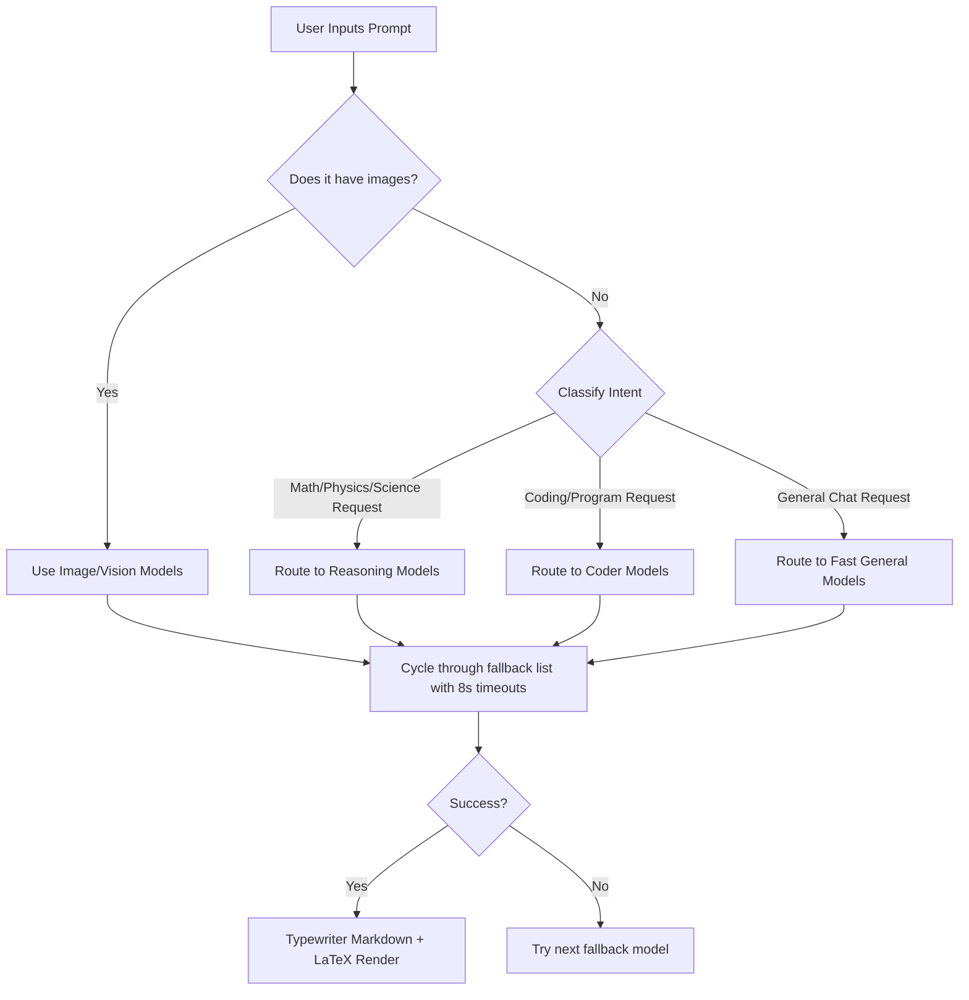

# JEE Prep Hub — Premium Study & Productivity Suite

JEE Prep Hub is an advanced study dashboard and productivity workspace custom-tailored for students preparing for competitive examinations (specifically the JEE/NEET exams). Built with a state-of-the-art tech stack, this application features offline capability via the **File System Access API**, programmatic audio synthesis, spaced repetition question engines, browser-based OCR math crop suites, ambient noise mixers, visual graphing calculator widgets, interactive physics/chemistry canvases, and an intelligent double-fallback YouTube parsing system for both local server and purely static server builds.

---

## Table of Contents
1. [Key Architectural Designs](#key-architectural-designs)
2. [Global Layout & UI Shell Components](#global-layout--ui-shell-components)
3. [Focus Lockdown Subsystem (Anti-Distraction)](#focus-lockdown-subsystem-anti-distraction)
4. [Daily Activity Streak Tracker & Gamification](#daily-activity-streak-tracker--gamification)
5. [Sprout Focus Garden System](#sprout-focus-garden-system)
6. [Workspace Local Directory Synchronizer](#workspace-local-directory-synchronizer)
7. [AI Chat, Live Crawling, & RAG Search Subsystem](#ai-chat-live-crawling--rag-search-subsystem)
8. [Background AI Quiz Generator Subsystem](#background-ai-quiz-generator-subsystem)
9. [Scientific Simulations & Interactive Graphing Widgets](#scientific-simulations--interactive-graphing-widgets)
10. [Page-by-Page Feature Matrix & Implementation Details](#page-by-page-feature-matrix--implementation-details)
11. [Workspace Local Storage Database Schema](#workspace-local-storage-database-schema)
12. [Low-Level Helper Systems](#low-level-helper-systems)
13. [Getting Started & Development Guides](#getting-started--development-guides)
14. [Workspace Dependency Breakdown](#workspace-dependency-breakdown)

---

## Key Architectural Designs

### 1. Unified Concurrent Architecture
The application runs both the Vite React frontend and the Express REST/media-streaming backend in a unified repository structure. Running `npm run dev` starts both servers concurrently:
* **Frontend Dev Server**: Port `21847` (Vite)
* **Backend API Server**: Port `8080` (Express)

### 2. Dual Build-Target Capability
The workspace supports both:
1. **Static Build Output (`dist/`)**: Runs purely inside client browsers. If the backend Express server on port 8080 is offline, the client application activates robust client-side API proxies, scraping HTML pages natively in-browser and extracting media tracks directly.
2. **Single-Process Production Build**: Runs the compiled static frontend served from Node/Express statically, with SPA routing mapping all wildcards back to `index.html`.

---

## Global Layout & UI Shell Components

### 1. Command Palette
* **Code Location**: [src/App.tsx](file:///workspaces/JeeAppv9/artifacts/jee-prep/src/App.tsx)
* **Trigger**: Activated by hitting `Ctrl + K` or `Cmd + K` on the keyboard (safely disabled in Focus Lockdown mode).
* **Features**: Smooth Framer-Motion slide-in modal with fuzzy searching over active pages:
  * *Dashboard*, *Calendar & Tags*, *Focus Music*, *PDF Viewer*, *Videos*, *Movie Hub*, *Admin Panel*, *Saves & Flashcards*, *AI Chat*, *Zen Mixer*.

### 2. Collapsible Navigation Sidebar
* **Code Location**: [src/components/Sidebar.tsx](file:///workspaces/JeeAppv9/artifacts/jee-prep/src/components/Sidebar.tsx)
* **Features**: A space-conscious vertical navigation sidebar that supports full collapsing to icons, animated hover states, dynamic route selection indicators, and responsive mobile drawers.

### 3. TopBar & Theme Engine
* **Code Location**: [src/App.tsx](file:///workspaces/JeeAppv9/artifacts/jee-prep/src/App.tsx)
* **Features**: Displays the current page tag and handles dynamic dark/light mode switches, storing state in `localStorage` under the `"theme"` key. When Focus Lockdown Mode is active, a red-pulsing badge shows the time remaining.

### 4. Floating Mini-Players
* **Audio MiniPlayer** ([src/components/MiniPlayer.tsx](file:///workspaces/JeeAppv9/artifacts/jee-prep/src/components/MiniPlayer.tsx)): Persistent player managing playback states, volume, track timeline seek-scrubbing, and visualizer nodes. Tapping minimize morphs the player into a small floating centered progress pill that expands automatically on hover or when a new track loads.
* **Video Picture-in-Picture Player** ([src/components/VideoMiniPlayer.tsx](file:///workspaces/JeeAppv9/artifacts/jee-prep/src/components/VideoMiniPlayer.tsx)): Detaches from the main lecture page, floating over other dashboard sections so students can review notes or schedules while keeping the lecture visual in sight.

---

## Focus Lockdown Subsystem (Anti-Distraction)

The Focus Lockdown mode is a strict anti-procrastination shield implemented via a global provider to keep students inside the study workspace.

* **Code Location**: [src/context/LockdownContext.tsx](file:///workspaces/JeeAppv9/artifacts/jee-prep/src/context/LockdownContext.tsx)
* **Activation Rules**:
  * Launched via a user-defined session duration (converts duration to target milliseconds).
  * Requests browser fullscreen mode automatically on launch.
  * Navigates the router back to the Home Dashboard page immediately.
* **Security Constraints**:
  * **Routing Lockdown**: Restricts navigation links. Wouter URL routes are locked exclusively to the Dashboard (`/`), PDF Annotator (`/pdf`), and Saved Questions (`/saves`). Clicking any other route (like Videos, Movies, or Zen Mixer) redirects the user back to the Dashboard.
  * **Keyboard Shortcuts Blocking**: Listens to keydown events and intercept/disables critical browser controls: `F12`, `Ctrl + Shift + I` (Inspect Element), `Ctrl + Shift + J` (Console), and `Ctrl + U` (View Page Source).
  * **ContextMenu Blocker**: Intercepts `contextmenu` mouse events to fully disable the mouse right-click menu.
  * **Fullscreen Break Detection**: Listens to browser `fullscreenchange` events. If the user exits fullscreen mode (e.g. by hitting `Esc` or clicking away), it immediately triggers a **Break Lockdown** routine.
* **Streak Reset Penalty**: If the lockdown is broken prematurely:
  * Exits fullscreen mode.
  * Logs the session status as `'broken'` in `jee_lockdown_records`.
  * **Resets the user's consecutive study streak to 0** in `jee_streak_data`.
  * Fires an alert warning the student that their focus streak has been reset to zero.

---

## Daily Activity Streak Tracker & Gamification

To encourage consistency, the app tracks a consecutive daily study streak backed by custom recovery mechanics.

* **Code Location**: [src/context/StreakContext.tsx](file:///workspaces/JeeAppv9/artifacts/jee-prep/src/context/StreakContext.tsx)
* **Streak Parameters**:
  * **Target Threshold**: A user must accumulate a minimum of **10 minutes (600 seconds)** of focus/study time in a single day to earn that day's streak marker.
  * **Study Time Ticker**: A background thread checks the active state and increments `jee_streak_today` (seconds, date, streakEarned) in real time.
* **Gap Healing & Streak Extensions**:
  * If a student misses a day, their streak normally breaks and resets to `1` on their next study day.
  * Gaps can be healed using **Streak Extensions** (up to **5 extensions per month** allowed).
  * `extendStreak()` places an `{ date, type: "extended" }` record for the missed day.
  * When computing the current streak, `computeNewStreak()` uses an algorithm that traverses the activity history. If a day gap exists, it checks if an extension record exists for that date to bridge the gap. If so, it preserves the streak count.

---

## Sprout Focus Garden System

The Focus Garden is a visual feedback mechanic rewarding students for completed Pomodoro blocks.

* **Code Location**: [src/components/TimeManagementWidget.tsx](file:///workspaces/JeeAppv9/artifacts/jee-prep/src/components/TimeManagementWidget.tsx)
* **Plant Growth Rule**:
  * Ticks along with the customizable countdown timers.
  * If a user completes a focus timer of **25 minutes or more (>= 1500 seconds)**, a plant seed is successfully grown.
* **Storage & Types**:
  * Selects a random seed emoji from: `["🌲", "🌳", "🌵", "🪴", "🌴", "🌻", "🍁", "🍄", "🌺"]`.
  * Logs the item under the local storage key `"jee_tm_garden"`. Each record contains `{ id: timestamp, name: timerName, date: isoTimestamp, type: emoji }`.
  * The **Garden Panel** displays a grid of these grown plants with a hover details card showing the timer name and sprout date.

---

## Workspace Local Directory Synchronizer

To enable true offline capabilities, JEE Prep Hub synchronizes all client data directly to a local directory of the user's PC using the modern browser **File System Access API**.

* **Code Location**: [src/context/WorkspaceContext.tsx](file:///workspaces/JeeAppv9/artifacts/jee-prep/src/context/WorkspaceContext.tsx)
* **Bootup & Permissions Flow**:
  * The context checks `workspace_dir_handle` inside the browser's IndexedDB on app mount.
  * If found, it displays a **Resume Workspace** overlay demanding read/write permissions. Tapping "Grant Access" triggers `requestPermission({ mode: 'readwrite' })`.
  * If no handle exists, it prompts the user to select a folder on their PC (e.g. `D:\JEE_Data`) using `showDirectoryPicker`.
* **The Sync Loop**:
  * Every **2 seconds**, a background synchronization loop scans the browser's `localStorage`.
  * It compiles all keys matching `jee_`, `pdf_anno_`, `theme`, and `user` into a single JSON object.
  * Objects/arrays are formatted as beautifully structured, human-readable JSON strings and written directly into `jee-data.json` inside the mounted directory.
* **Storage Footprint Pruning**:
  * IndexedDB has a default storage limit. To prevent bloat, once a local folder is mounted, the context runs a cache cleanup routine.
  * It deletes heavy binary items (like PDF buffers, cropped image files, drawings, video frame screenshots, and audio recordings) from the browser's IndexedDB.
  * This drops the browser's native IndexedDB cache footprint to a mere **~3KB**, delegating all data storage to the local PC folder.
* **Sub-folder Media Routing**:
  * When binary files are saved (e.g., question snaps, voice recordings), they are written to a `Media/` sub-folder in the workspace directory via `writeMedia(filename, Blob)`.
  * Reading files uses custom helpers `readMediaAsBlob` and `readMediaAsArrayBuffer`. If the workspace folder is not supported (e.g., in legacy browsers), it seamlessly falls back to saving raw data inside IndexedDB.

---

## AI Chat, Live Crawling, & RAG Search Subsystem

The AI Chat companion is a core academic tool equipped with automated search classification, text crawling, and model fallback cascades.

* **Code Location**: [src/pages/AI.tsx](file:///workspaces/JeeAppv9/artifacts/jee-prep/src/pages/AI.tsx)



### 1. Dynamic Task Routing
Before sending a request to OpenRouter, the app scans the query text and routes it to specialized model lists:
* **Vision/Image Tasks**: If the message contains image attachments, it prioritizes:
  * `nvidia/nemotron-3-nano-omni-30b-a3b-reasoning:free`
  * `nvidia/llama-nemotron-rerank-vl-1b-v2:free`
  * `google/gemma-4-31b-it:free`
* **Math & Scientific Reasoning**: If the query mentions physics, chemistry, solve, or equations, it prioritizes:
  * `qwen/qwen-2.5-coder-32b-instruct:free`
  * `meta-llama/llama-3.3-70b-instruct:free`
  * `liquid/lfm-2.5-1.2b-thinking:free`
* **Coding/Scripting**: For coding instructions, it runs:
  * `qwen/qwen-2.5-coder-32b-instruct:free`
  * `openai/gpt-oss-120b:free`
* **General Chat**: Fast fallback models:
  * `google/gemma-2-9b-it:free`
  * `openai/gpt-oss-20b:free`

### 2. Multi-Model Fallback Cascade
* The frontend iterates over the target models list sequentially.
* Each model is assigned a strict **8-second abort signal timeout**.
* If a model times out, returns an error (such as rate-limits/quota errors), or fails to connect, the controller catches the error and tries the next model in the array, ensuring the user gets a response without manual retries.

### 3. Real-Time Web Search (RAG Mode)
* If the prompt contains words like `news`, `today`, `latest`, `current`, or `realtime`, the chat classifies it as a search query.
* It automatically appends the current year (e.g. `2026`) and calls a DuckDuckGo scraper endpoint.
* **Month-Filtered Search**: Hits DuckDuckGo with a month filter (`&df=m`). If empty, it falls back to a year filter (`&df=y`), and finally to a general search.
* **OG Thumbnail Scraping**: For the top 4 search links, it crawls the landing page to extract `<meta property="og:image">` tags to render thumbnail cards.
* **Citations & Favicons**: The prompt is injected with a system instruction containing the search context and a date anchor forcing the LLM to write a synthesized summary with hyperlinked citations (e.g., `[Source X]`). Favicons are resolved dynamically using Google's favicon helper.

### 4. Direct Crawler Pipeline
If a user explicitly commands the AI to visit or crawl a link, the app routes requests to the backend `/api/scrape?url=...` or client-side CORS proxies:
* **YouTube Video/Channel Resolver**: Uses `play-dl` to pull titles, creators, likes, views, and description metadata.
* **GitHub Rewriter**: Rewrites standard file viewer links (`/blob/`) to raw contents links (`raw.githubusercontent.com`) to extract the code directly.
* **PDF Scraper**: If the URL points to a `.pdf`, it downloads the file, starts `pdfjs-dist` in-browser, extracts the text content page-by-page (capped at 10 pages), and feeds it to the AI.
* **Social Media Scraper**: Bypasses login walls of Instagram, Snapchat, and LinkedIn by targeting OpenGraph meta summary tags.

### 5. LaTeX Integration
* Chat uses KaTeX to render inline math formulas (wrapped inside `$ ... $`) and block equations (wrapped inside `$$ ... $$`) dynamically.

---

## Background AI Quiz Generator Subsystem

The AI Quiz Generator allows students to compile fully customized study exams complete with diagrams mapped back to their saved question banks.

* **Code Location**: [src/pages/QuizPage.tsx](file:///workspaces/JeeAppv9/artifacts/jee-prep/src/pages/QuizPage.tsx)

### 1. Quiz Generator Manager (`QuizGeneratorManager`)
* Instantiates a single background queue supervisor.
* Listens to the window `beforeunload` event. If a quiz generation job is active in the background, it alerts the user that closing the browser will abort progress.
* Exposes a `stopJob(jobId)` callback that fires an abort signal to immediately stop OpenRouter API completions.

### 2. Context Slicing Helper
* Standard JEE quizzes contain dozens of questions and files, resulting in huge context sizes that exceed API token limits.
* The generator utilizes `getContextSlice(batchIdx, totalBatches)` to divide the raw PDF text, videos, URLs, and saved question summaries.
* It splits the text into chunks matching the number of batch queries with a **15% text overlap** on borders to ensure context is not severed.

### 3. Subject Planning & Distribution
* Planning is aligned with the student's study target (selected via the goal selection wizard):
  * **JEE**: Splits questions between Physics, Chemistry, Maths.
  * **NEET**: Splits questions between Physics, Chemistry, Biology.
  * **UPSC**: Splits questions between History, Polity, Geography, Economy, CSAT, and Current Affairs.
  * **Boards**: Splits based on Arts/Commerce/Science stream configurations.
  * **Olympiads**: Splits between Mathematics, Physics, Chemistry, Biology, Astronomy, and Mental Ability.

### 4. Diagram Mapping Pipeline
* When the AI returns a quiz JSON object, it details the source question IDs if the question was derived from the student's saves.
* The generator maps the question to the saves database. If a match is found, it copies the saved `imageKey` or `imageUrl` to the quiz question.
* The `QuestionImage` component detects these keys, fetches the cropped image blob from the local workspace folder, and displays it inline above the multiple-choice options.

---

## Scientific Simulations & Interactive Graphing Widgets

If the AI companion detects a mathematical or physical concept instruction (or a custom JSON block is returned), it spawns interactive simulation canvases.

* **Code Location**: [src/components/AICustomWidgets.tsx](file:///workspaces/JeeAppv9/artifacts/jee-prep/src/components/AICustomWidgets.tsx)

| Simulation / Widget Name | Visual Render | Key Controls & Sliders | Equations & Mathematical Evaluation |
| :--- | :--- | :--- | :--- |
| **`GraphWidget`** | Cartesian grid canvas | Equation inputs (e.g. `sin(x) * 2`), constant sliders, canvas panning/zooming, mouse coordinate hover | Evaluates equations, draws curves, handles mouse click-and-drag grid translations. |
| **`Projectile Sim`** | Projectile trajectory path | Angle (0°-90°), Initial Velocity ($v_0$), Gravity ($g$), Launch Height ($h$) | Flight time: $t = \frac{v_{0y} + \sqrt{v_{0y}^2 + 2gh}}{g}$. Plots peak coordinates and total range. |
| **`Buoyancy Sim`** | Water beaker with blocks | Block mass ($m$), volume ($V$), fluid density ($\rho_f$) | Block density: $\rho_b = \frac{m}{V}$. Renders submersion level, gravity vector, and upward buoyant force ($F_b = \rho_f V_{\text{disp}} g$). |
| **`Electricity Sim`** | Wire schematic with battery | Voltage ($V$), Resistor ($R$) | Current: $I = \frac{V}{R}$. Power: $P = I^2 R$. Animates electron flow speed along wire paths based on calculated current. |
| **`Bohr Atom Model`** | Orbiting electron rings | Orbit transition levels ($n=1$ to $n=5$) | Rydberg formula evaluates transition energy differences and triggers wavelet animations. Wavelength: $\lambda = \frac{1240}{\Delta E}$ nm. |
| **`SHM Pendulum/Spring`** | Oscillating pendulum/spring | Length ($L$), mass ($m$), spring constant ($k$), initial amplitude | Animates harmonic motion. Plots velocity vs displacement phase space graphs and updates kinetic/potential energy charts. |
| **`Bonding Sim`** | Atomic covalent bonds | Molecular toggles ($H_2O$, $CO_2$, $NaCl$) | Animates shared electron clouds and covalent/ionic rings. |

---

## Page-by-Page Feature Matrix & Implementation Details

### 1. Dashboard (Home)
* **Code Location**: [src/pages/HomePage.tsx](file:///workspaces/JeeAppv9/artifacts/jee-prep/src/pages/HomePage.tsx)
* **Countdown Flip Clock**: Retro flip cards counting days, hours, minutes, and seconds to target exam dates. Tapping edit allows the user to configure custom exam targets.
* **Todo Planner**:
  * Drag-and-drop task sorting.
  * Task categories (High, Medium, Low priority).
  * Built-in Pomodoro/Stopwatch timer per task. Completing tasks updates study history.
* **Resizable Panels**: The home layout height partition between the Todo list and the Calendar scheduler is resizable by dragging a center handle (implemented in [src/components/ResizableSection.tsx](file:///workspaces/JeeAppv9/artifacts/jee-prep/src/components/ResizableSection.tsx)), with split heights saved to local storage.

### 2. PDF Library & Annotator
* **Code Location**: [src/pages/PDFPage.tsx](file:///workspaces/JeeAppv9/artifacts/jee-prep/src/pages/PDFPage.tsx)
* **Hierarchical Folders**: Arrange PDF worksheets, books, and practice tests into customized Sections, Sub-sections, and Sub-sub-sections.
* **Pen Vector Canvas**:
  * Custom drawing overlay. Tools: Pen, Highlighter, Arrow, Text boxes, Rectangles, Circles, Triangles, Eraser.
  * Adjust stroke width and select custom hex colors from a palette picker.
  * Supports full undo/redo capabilities (`undoStack`, `undoIdx` tracking).
* **Crop Snipping Tool**: Draw a bounding box over a math diagram or question. The crop area is exported as a canvas image snippet and saved directly to the Saved Question bank.

### 3. Video Lecture Suite
* **Code Location**: [src/pages/VideoPage.tsx](file:///workspaces/JeeAppv9/artifacts/jee-prep/src/pages/VideoPage.tsx)
* **Dual Player Engine**: Native HTML5 file player with `hls.js` stream decoding and distraction-free YouTube embed streams.
* **Timeline Notes**:
  * Create study notes linked to video timestamps.
  * Attach canvas screenshot snapshots of the video frame.
  * Attach **Voice Notes**: Integrates a microphone voice recorder that saves audio blocks directly to the local folder.
* **A-B Looping**: Define starting and ending bounds on the lecture timeline to continuously loop a segment (ideal for complex equation derivations).

### 4. Saves (Question Bank)
* **Code Location**: [src/pages/SavesPage.tsx](file:///workspaces/JeeAppv9/artifacts/jee-prep/src/pages/SavesPage.tsx)
* **Folder Taxonomy**: Organizes questions under Physics, Chemistry, Maths, and custom chapters.
* **Browser OCR Text Scanner**: Runs `Tesseract.js` directly within the browser thread to scan cropped question images and extract texts/equations.
* **Spaced Repetition System (SRS)**: Sets customizable recall intervals (e.g. 1 day, 3 days, 7 days). Track memorization decay stats over time.
* **PDF Exporter**: Package saved question images, text questions, and written answers into a printable PDF study package.

### 5. Focus Music & Zen Mixer
* **Music Hub** ([src/pages/MusicPage.tsx](file:///workspaces/JeeAppv9/artifacts/jee-prep/src/pages/MusicPage.tsx)): Playlists managing local MP3 uploads, streaming audio urls, and YouTube imports.
* **Ambient Mixer** ([src/components/AmbientMixer.tsx](file:///workspaces/JeeAppv9/artifacts/jee-prep/src/components/AmbientMixer.tsx)): Zen noise controller supporting rain, coffee shop, white noise, forest, and waves.
* **Mixkit Web Scraper**: Type search terms inside the zen panel to fetch custom ambient loops from Mixkit and Archive.org via client-side proxies.

### 6. Calendar & Tag Scheduler
* **Code Location**: [src/pages/CalendarPage.tsx](file:///workspaces/JeeAppv9/artifacts/jee-prep/src/pages/CalendarPage.tsx)
* **Agenda Grids**: Month, Week, and Day grids. Custom color tags categorize different domains (classes, self-study, mocks).
* **Synthesizer Alarms**: Setup alarms that trigger custom oscillator sound wave patterns.

### 7. Movie Hub (Study Breaks)
* **Code Location**: [src/pages/MovieHub.tsx](file:///workspaces/JeeAppv9/artifacts/jee-prep/src/pages/MovieHub.tsx)
* **TMDB watchlists**: Custom watchlists backed by TMDB keys to bypass rate limits.
* **Redundant Stream Servers**: Automatically cycles through 5 embed servers: `vidking`, `2Embed`, `XPS`, `VidSrc Pro`, and `Hindi Multi-Audio`.
* **Ad-Hijack Prevention**: Event listeners capture window `blur` events. If an iframe tries to redirect focus to an external tab, it instantly refocuses the main viewport to block ad page hijacking.

### 8. Admin Page & Analytics
* **Code Location**: [src/pages/AdminPage.tsx](file:///workspaces/JeeAppv9/artifacts/jee-prep/src/pages/AdminPage.tsx)
* **Study Milestones**: Log mock test scores, predicts score percentiles, and records study targets.
* **Performance Charts**: Plots heap memory allocation, simulated CPU loads, and storage quotas using Recharts.
* **API Keyring**: Secure keyring panel to register and test connections for OpenRouter (AI Models) and TMDB (Movies).

---

## Workspace Local Storage Database Schema

When syncing to `jee-data.json`, the synchronizer captures specific local storage structures:

| Storage Key | Data Structure Type | Key Sub-fields / Properties |
| :--- | :--- | :--- |
| **`jee_user_streak`** | Object | `{ currentStreak: number, lastEarnedDate: string, records: Array<{date: string, type: 'earned'\|'extended'}>, extendsUsedThisMonth: number, extendsResetMonth: string }` |
| **`jee_saves_questions_v1`** | Array | List of items: `{ id: string, name: string, description: string, answerText: string, questionImageKey: string, answerImageKey: string, srsInterval: number, nextReview: number, isCorrect: boolean }` |
| **`jee_saved_quizzes_v1`** | Array | List of quizzes: `{ id: string, name: string, createdAt: number, questions: Question[], score: number, difficulty: string }` |
| **`jee_time_tracking`** | Object | Key-value pairs matching page routes to accumulated study time in seconds: `{ "/": 120, "/pdf": 3400, "/ai": 1200 }` |
| **`jee_ai_chats`** | Array | Chat sessions list: `{ id: string, title: string, messages: Array<{ role: 'user'\|'model', content: string, timestamp: number, isTyping?: boolean, liked?: boolean }> }` |
| **`jee_admin_timeline`** | Array | Milestones list: `{ id: string, title: string, date: string, type: 'milestone'\|'exam'\|'mock', details: string }` |
| **`jee_saved_playlists_v1`** | Array | Playlists layout: `{ id: string, name: string, songs: Array<{ id: string, title: string, artist: string, url?: string, mediaKey?: string }> }` |
| **`jee_tm_garden`** | Array | Grown plants list: `{ id: number, name: string, date: string, type: string }` |
| **`pdf_anno_[leaf]_[page]`** | Array | PDF annotation vectors list: `{ id: string, type: 'pen'\|'highlighter'\|'rect'\|'circle'\|'text', points: Point[], color: string, strokeWidth: number }` |

---

## Low-Level Helper Systems

### 1. Programmatic Web Audio Synthesizer
* **Code Location**: [src/utils/audio.ts](file:///workspaces/JeeAppv9/artifacts/jee-prep/src/utils/audio.ts)
* **Beep Patterns**: Synthesizes clean alerts using the browser **Web Audio API** (`AudioContext`). Generates triple-beeps for timers and alternating alarms.
* **Volume Ramps**: Uses linear and exponential gain scaling to prevent clicking and clipping on speakers.

### 2. Double-Fallback YouTube Fetcher
* **Code Location (Server)**: [server.js](file:///workspaces/JeeAppv9/artifacts/jee-prep/server.js)
* **Code Location (Client)**: [src/utils/search.ts](file:///workspaces/JeeAppv9/artifacts/jee-prep/src/utils/search.ts)
* **Scenario A (Server Online)**: Hits `/api/media-info?url=...`. Attempts HTML scraping with brace-counting characters parsing, falls back to `play-dl` backend library.
* **Scenario B (Server Offline/Static Dev)**:
  * Races three CORS proxies (Codetabs, Allorigins, Corsproxy.io) to scrape the YouTube HTML page and extract `ytInitialData`.
  * If HTML fails, it fetches the YouTube RSS Feed xml (`/feeds/videos.xml?playlist_id=...`) and parses entries.
  * If RSS fails, it races connections to Invidious and Piped public API mirror instances with a 6-second timeout.

### 3. YouTube Media Stream Cache (`/api/stream`)
* **Code Location**: [server.js](file:///workspaces/JeeAppv9/artifacts/jee-prep/server.js)
* **Cachng Map (`audioCache`)**: Caches requested streams as `downloading`, `ready`, or `error`.
* **Range Requests**: Supports HTTP `206` range requests. If a track is cached, Node slices the buffer to allow instant scrubbing.
* **Piping**: If a track is not cached, it spawns `yt-dlp` to fetch audio streams, pipes chunks directly to the response header in real time (for instant play), and saves chunks to the cache array upon exit.

### 4. Text-to-Speech Engine
* **Code Location**: [src/pages/AI.tsx](file:///workspaces/JeeAppv9/artifacts/jee-prep/src/pages/AI.tsx)
* **Language Detection**: Custom regex scans for Hindi characters or Latinized Hinglish text.
* **Voice Selection**: Maps Hindi text to premium Hindi voices (Swara/Kalpana) and Latinized Hinglish to Indian English accents (Neerja/Veena), falling back to high-quality female English voices (Aria/Jenny) if unavailable.

### 5. Semantic Vector Search
* **Code Location**: [src/utils/embedding.ts](file:///workspaces/JeeAppv9/artifacts/jee-prep/src/utils/embedding.ts)
* **Vector Models**: Queries the OpenRouter Embeddings API using `nvidia/llama-nemotron-embed-vl-1b-v2:free`.
* **Reranker Similarity**: Evaluates cosine similarity to rank documents. Automatically switches to a token overlap algorithm (Jaccard) when offline.

---

## Getting Started & Development Guides

### 1. Install Dependencies
Run from the root workspace directory:
```bash
pnpm install
```

### 2. Launch Development Servers
Start both the Express API and Vite React client concurrently:
```bash
pnpm dev
```

### 3. Build Static Assets
Compile the React frontend app:
```bash
pnpm build
```
Static production files will be output to the `dist/` directory.

### 4. Start Production Server
Launch the Express backend to serve the static frontend bundle:
```bash
NODE_ENV=production node server.js
```

---

## Workspace Dependency Breakdown

### Express Core & Streaming Backend
* `express`: Web server framework.
* `cors`: Cross-Origin Resource Sharing.
* `play-dl`: YouTube search and metadata resolver.
* `@distube/ytdl-core`: YouTube streaming media tool.
* `msedge-tts`: Microsoft Edge TTS synthesis package.

### React Core & Client Interfaces
* `react` & `react-dom`: Component layout engines.
* `wouter`: Lightweight router for Single Page Apps (SPA).
* `framer-motion`: Motion and transition animations.
* `lucide-react`: SVG icon library.
* `@tanstack/react-query`: Server state synchronization.

### Data Manipulation & File Sync
* `jszip`: Compresses binary backups into zip files.
* `katex` & `rehype-katex`: Mathematical symbol and equation rendering.
* `react-markdown`: Renders text components dynamically.
* `recharts`: Studying time statistics and tracking charts.