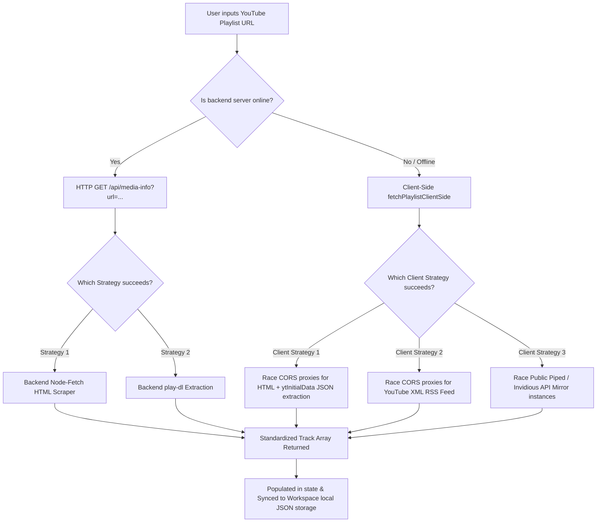
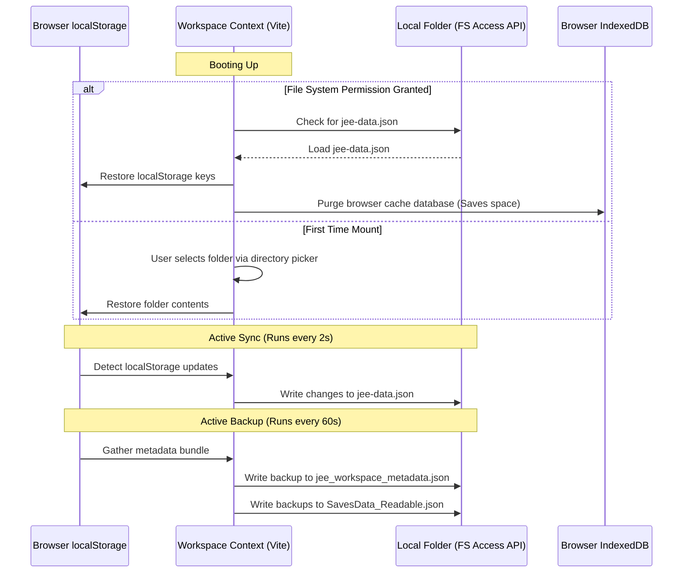

# JEE Prep Hub — Premium Study & Productivity Suite

JEE Prep Hub is an advanced study dashboard and productivity workspace custom-tailored for students preparing for competitive examinations (specifically the JEE exam). Built with a state-of-the-art tech stack, this application features full offline capability via the **File System Access API**, programmatic audio synthesis, spaced repetition question engines, browser-based OCR math crop suites, ambient noise mixers, visual graphing calculator widgets, interactive physics/chemistry canvases, and an intelligent double-fallback YouTube parsing system for both local server and purely static server builds.

---

## Table of Contents
1. [Key Architectural Designs](#key-architectural-designs)
2. [Global Layout & UI Shell Components](#global-layout--ui-shell-components)
3. [Page-by-Page Feature Matrix](#page-by-page-feature-matrix)
4. [Deep Dive: YouTube Video & Playlist Fetching & Streaming Subsystem](#deep-dive-youtube-video--playlist-fetching--streaming-subsystem)
5. [Deep Dive: AI Real-Time Web Search & RAG Information Gathering](#deep-dive-ai-real-time-web-search--rag-information-gathering)
6. [Interactive AI Companion & Simulation Widgets](#interactive-ai-companion--simulation-widgets)
7. [Workspace Local Directory Synchronizer](#workspace-local-directory-synchronizer)
8. [Offline Local Storage & Cache Purification](#offline-local-storage--cache-purification)
9. [Low-Level Helpers & Custom Synthesizers](#low-level-helpers--custom-synthesizers)
10. [Getting Started & Development Guides](#getting-started--development-guides)
11. [Workspace Dependency Breakdown](#workspace-dependency-breakdown)

---

## Key Architectural Designs

### 1. Unified Concurrent Architecture
The application runs both the Vite React frontend and the Express REST/media-streaming backend in a unified repository structure. Running `pnpm run dev` starts both servers concurrently on:
* **Frontend Dev Server**: Port `21847` (Vite)
* **Backend API Server**: Port `8080` (Express)

### 2. Dual Build-Target Capability
The workspace supports both:
1. **Static Build Output (`dist/`)**: Runs purely inside client browsers. If the backend Express server on port 8080 is offline, the client application activates robust client-side API proxies, scraping HTML pages natively in-browser and extracting media tracks directly.
2. **Single-Process Production Build**: Runs the compiled static frontend served from Node/Express statically, with SPA routing mapping all wildcards back to `index.html`.

---

## Global Layout & UI Shell Components

### 1. Command Palette
* **Trigger**: Activated by hitting `Ctrl + K` or `Cmd + K` on the keyboard (safely disabled in Focus Lockdown mode).
* **Location**: [src/App.tsx](file:///workspaces/JeeAppv9/artifacts/jee-prep/src/App.tsx#L64-L122).
* **Features**: Smooth Framer-Motion slide-in modal with fuzzy searching over 10 active pages:
  * *Dashboard*, *Calendar & Tags*, *Focus Music*, *PDF Viewer*, *Videos*, *Movie Hub*, *Admin Panel*, *Saves & Flashcards*, *AI Chat*, *Zen Mixer*.

### 2. Collapsible Navigation Sidebar
* **Location**: [src/components/Sidebar.tsx](file:///workspaces/JeeAppv9/artifacts/jee-prep/src/components/Sidebar.tsx).
* **Features**: A space-conscious vertical navigation sidebar that supports full collapsing to icons, animated hover states, dynamic route selection indicators, and responsive mobile drawers.

### 3. TopBar & Theme Engine
* **Location**: [src/App.tsx](file:///workspaces/JeeAppv9/artifacts/jee-prep/src/App.tsx#L124-L171).
* **Features**: Displays the current page tag and handles dynamic dark/light mode switches, storing state in `localStorage` under the `"theme"` key. When Focus Lockdown Mode is active, a red-pulsing badge shows the time remaining.

### 4. Floating Mini-Players
* **Audio MiniPlayer**: [src/components/MiniPlayer.tsx](file:///workspaces/JeeAppv9/artifacts/jee-prep/src/components/MiniPlayer.tsx) stays persistent at the bottom of the layout, managing playback states, volume, track timeline seek-scrubbing, and visualizer nodes.
* **Video Picture-in-Picture Player**: [src/components/VideoMiniPlayer.tsx](file:///workspaces/JeeAppv9/artifacts/jee-prep/src/components/VideoMiniPlayer.tsx) detaches from the main lecture page, floating over other dashboard sections so students can review notes or schedules while keeping the lecture visual in sight.

---

## Page-by-Page Feature Matrix

### 1. Dashboard (Home)
* **File Location**: [src/pages/HomePage.tsx](file:///workspaces/JeeAppv9/artifacts/jee-prep/src/pages/HomePage.tsx).
* **High-Precision Exam Countdown**: A retro-style digital flip-clock widget. Users can input target exam dates (e.g. JEE Main/Advanced) and time targets, which are parsed and updated down to the second.
* **Daily Activity Streak Tracker**: Linked to the [src/context/StreakContext.tsx](file:///workspaces/JeeAppv9/artifacts/jee-prep/src/context/StreakContext.tsx) API. Plots a visual representation of the consecutive study streak (including last active markers, active dates list, and bonus multiplier triggers).
* **Todo Planner**: Located in [src/components/TodoSystem.tsx](file:///workspaces/JeeAppv9/artifacts/jee-prep/src/components/TodoSystem.tsx). Features dragging list groups, prioritizing task rows (High, Medium, Low), allocating calendar tags, and tracking checkboxes.
* **Integrated Day Schedule**: Fetches schedule tags and timeline slots from the calendar database and dynamically overlays them onto today's view.
* **Focus Lockdown Mode**: Configured in [src/context/LockdownContext.tsx](file:///workspaces/JeeAppv9/artifacts/jee-prep/src/context/LockdownContext.tsx). Allows locked time sessions. During this timer, a dark translucent overlay blocks out navigation links, distracting widgets, and keyboard page navigation shortcuts.
* **Custom Layout Heights**: Height partitions of the Todo and Calendar containers on the home page can be adjusted by dragging handles (using [src/components/ResizableSection.tsx](file:///workspaces/JeeAppv9/artifacts/jee-prep/src/components/ResizableSection.tsx)), with values automatically saved in `localStorage`.

### 2. PDF Library & Annotator
* **File Location**: [src/pages/PDFPage.tsx](file:///workspaces/JeeAppv9/artifacts/jee-prep/src/pages/PDFPage.tsx).
* **Document Tree Hierarchy**: Organize PDF study sheets, books, and practice tests into customized Sections, Sub-sections, and individual files.
* **Drawing & Notation Canvas**: Custom pen drawing layers overlaying the PDF rendering engine. Includes:
  * *Tools*: Pen, Highlighter, Arrow, Text boxes, Rectangle outline, Circle, Triangle, and Eraser brush.
  * *Customizations*: Stroke thickness sliders and a custom hex/color picker that saves chosen colors directly to the database.
* **Visual Bounding Box Cropper**: Drag a bounding box over any section of a PDF sheet (such as a math question). The cropped area is saved as an image snippet directly in the Saves/Question Bank database.
* **Import Targets**: Directly uploads local files, processes image scans, or fetches online PDFs bypassing CORS blocks via the `/api/search` proxy.

### 3. Video Lecture Suite
* **File Location**: [src/pages/VideoPage.tsx](file:///workspaces/JeeAppv9/artifacts/jee-prep/src/pages/VideoPage.tsx).
* **Dual Rendering Engines**: Supports both native local HTML5 video playback for uploaded files (using `hls.js` streams) and distraction-free YouTube video playback.
* **Timestamped Study Notes**: Allows clicking to add study notes directly tied to video timeline positions. The rich note card supports:
  * *Rich text*: Markdown structures.
  * *Voice notes*: Integrates a microphone recorder that stores recorded voice blocks directly in database storage.
  * *Video screenshot snapshots*: Captures frames from the canvas playback buffer.
* **A-B Looping Controller**: Marks custom starting (`A`) and ending (`B`) points on a lecture timeline. When enabled, the player loops that segment continuously (ideal for reviewing complex derivations).
* **Controls**: Dynamic playback speeds (up to `8x` rate), video quality controls, subtitles, and track selection.

### 4. Saves (Question Bank)
* **File Location**: [src/pages/SavesPage.tsx](file:///workspaces/JeeAppv9/artifacts/jee-prep/src/pages/SavesPage.tsx).
* **Taxonomy System**: Organizes question snippets under Subjects (*Physics, Chemistry, Maths*) and custom chapter folders.
* **Metadata Editor**: Allows users to attach written solutions, question tags, Spaced Repetition status, correct/incorrect markers, and flags.
* **Browser OCR Engine**: Integrates `Tesseract.js` directly within the browser tab. Extracts text and equations from cropped question images automatically.
* **Spaced Repetition System (SRS)**: Implements custom review interval timers (e.g. 1 day, 3 days, 7 days) and logs memory decay stats over time.
* **Export PDF Sheets**: Packages cropped question images, answers, and explanations into a clean, printable PDF study package.

### 5. Focus Music & Zen Mixer
* **Music Hub**: Located in [src/pages/MusicPage.tsx](file:///workspaces/JeeAppv9/artifacts/jee-prep/src/pages/MusicPage.tsx). Features playlists for local MP3 uploads, audio track URLs, and YouTube search results.
* **Zen Ambient Mixer**: Located in [src/components/AmbientMixer.tsx](file:///workspaces/JeeAppv9/artifacts/jee-prep/src/components/AmbientMixer.tsx). Manages simultaneous loops for ambient soundscapes (White Noise, Rain, Coffee Shop, Forest, Waves). Each channel has its own mute toggle, volume slider, and fade transition.
* **Merged Youtube Audio Fetching**: Search terms or copy-pasted video/playlist URLs in the search bar are dynamically routed to fetch individual tracks or extract entire playlists instantly.

### 6. Calendar Page
* **File Location**: [src/pages/CalendarPage.tsx](file:///workspaces/JeeAppv9/artifacts/jee-prep/src/pages/CalendarPage.tsx).
* **Grids**: Multi-tab schedule layouts supporting Monthly planner views, Weekly grids, and Daily agenda timelines.
* **Color Tagging**: Color tags represent different task domains (e.g., classes, self-study, mock tests). Recurring patterns (daily, weekly, custom days) are supported.
* **Timers & Countdown Alarms**: Custom study timers and alarm clocks with custom synthesizer sound triggers.

### 7. Movie Hub (Study Breaks)
* **File Location**: [src/pages/MovieHub.tsx](file:///workspaces/JeeAppv9/artifacts/jee-prep/src/pages/MovieHub.tsx).
* **TMDB Integration**: Browse trending movies, search for series, and track personal watch lists.
* **Multi-Node Embed Player**: Automatically cycles through 5 distinct iframe streaming nodes (*Vidking, 2Embed, XPS, VidSrc Pro, Hindi Multi-Audio*) to ensure uninterrupted streaming.
* **Focus-Hijack Blur Interception**: A specialized window event handler prevents redirect pages from hijacking user focus:
  ```typescript
  useEffect(() => {
    if (!playing) return;
    const handleWindowBlur = () => {
      setTimeout(() => {
        if (document.activeElement instanceof HTMLIFrameElement) {
          window.focus();
        }
      }, 50);
    };
    window.addEventListener("blur", handleWindowBlur);
    return () => window.removeEventListener("blur", handleWindowBlur);
  }, [playing]);
  ```

### 8. Admin Page
* **File Location**: [src/pages/AdminPage.tsx](file:///workspaces/JeeAppv9/artifacts/jee-prep/src/pages/AdminPage.tsx).
* **Journey Milestones**: Log mock test scores, study targets, milestones, and rank predictions.
* **Analytics**: Plots Recharts metrics showing study hours, daily task completion rates, page-by-page time allocation, and music streams.
* **Workspace Key Rings**: Custom interfaces to register and rotate API key configurations:
  * *OpenRouter API Keys* (for AI model chat interactions and embeddings).
  * *TMDB API Keys* (to bypass global rate limits on movie indexes).
  * *ElevenLabs Voice Configurations* (to authorize high-quality voice audio conversions).
* **Storage Performance Monitoring**: Real-time measurements of JS memory heap sizes, DOM frames-per-second main-thread loads, and `localStorage` storage allocations.

---

## Deep Dive: YouTube Video & Playlist Fetching & Streaming Subsystem

One of the most complex subsystems in the app is the YouTube audio/video parser and media-streaming backend. It is designed to work in two scenarios: when the backend Express server is running, and when the frontend is compiled as a static client-only app.



### 1. Client-Side Playlist Parsing (`fetchPlaylistClientSide`)
* **Location**: [src/utils/search.ts](file:///workspaces/JeeAppv9/artifacts/jee-prep/src/utils/search.ts#L345-L498)
* **Trigger**: Invoked when the user enters a YouTube playlist URL inside the Lecture suite or Music hub, and the local backend server is offline or fails to respond.
* **Processing Chain**:
  1. **URL Sanitization**: Extracts the `list=` parameter from the URL using Regex.
  2. **Strategy 1: HTML Scrape & Brace-Counting JSON Extraction (Up to 100 items)**
     * Races three public CORS-bypass proxies:
       * `https://api.allorigins.win/get?url=...`
       * `https://api.codetabs.com/v1/proxy?quest=...`
       * `https://corsproxy.io/?url=...`
     * On first proxy success, retrieves the full YouTube HTML string.
     * Searches for the JS initialization block `"ytInitialData"`.
     * **Brace Counting Algorithm**: Scans character-by-character from the initial `{` following `ytInitialData`. Increments a counter on `{` and decrements it on `}` while respecting string borders (`"` or `'`) and backslash escapes (`\`). Once the counter hits zero, it extracts the exact JSON block and parses it.
     * Recursively traverses the JSON object to locate any keys named `playlistVideoRenderer` or `videoRenderer`.
     * If the JSON parser fails, it runs a fallback anchor tag Regex search matching `/watch\?v=([a-zA-Z0-9_-]{11})/` to locate video IDs and titles.
  3. **Strategy 2: XML RSS Feed Fallback (Up to 15 items)**
     * If Strategy 1 yields 0 items, the client hits the YouTube RSS XML playlist endpoint: `https://www.youtube.com/feeds/videos.xml?playlist_id={listId}`.
     * Races the request across the CORS proxies.
     * Uses the browser's native `DOMParser()` to parse the text as `text/xml`.
     * Traverses the XML document for `<entry>` tags, extracting `<yt:videoId>`, `<title>`, and `<author>` tags using namespace-insensitive search (`getElementsByTagNameNS`).
  4. **Strategy 3: Multi-Tier Mirror Racing**
     * If RSS also fails, it fetches the list from public YouTube API mirrors (Piped and Invidious).
     * Retrieves instance lists via [src/utils/youtube.ts](file:///workspaces/JeeAppv9/artifacts/jee-prep/src/utils/youtube.ts) and filters them.
     * Races requests to the top 3 Piped endpoints (hitting `/playlists/${playlistId}`) and the top 3 Invidious endpoints (hitting `/api/v1/playlists/${playlistId}`) with a strict 6-second timeout.
     * Decodes the custom schemas of Piped (`v.relatedStreams`) and Invidious (`v.videos`) into a uniform format.
  5. **Deduplication and Limits**: Groups results, filters out deleted/private placeholders, deduplicates by YouTube ID, and returns the top 150 items.

### 2. Backend Playlist Parsing (Express REST API)
* **Location**: [server.js](file:///workspaces/JeeAppv9/artifacts/jee-prep/server.js#L447-L835)
* **Endpoint**: `GET /api/media-info?url={URL}`
* **Process**:
  1. Detects type of URL (`yt_video`, `yt_playlist`, `sp_track`).
  2. **Strategy 1: Scraping YouTube Page HTML**:
     * Node performs a `fetch()` with Chrome headers directly to the YouTube playlist page.
     * Scans for renderer keys (`playlistVideoRenderer`, `lockupViewModel`, `gridVideoRenderer`, etc.).
     * Performs character block extraction (brace counting) to extract individual metadata blocks without parsing the entire page's massive HTML script, ensuring fast resolution.
  3. **Strategy 2: play-dl Library Fallback**:
     * Runs `playdl.playlist_info(url, { incomplete: true })` inside a promise race with an 8-second timeout.
     * Extracts tracks from the playlist page.
  4. **Spotify Track Resolution**:
     * Hitting Spotify oEmbed: `https://open.spotify.com/oembed?url={spotifyUrl}`.
     * Extracts track name and artist.
     * Queries YouTube search API internally: `playdl.search(query, { source: { youtube: "video" }, limit: 1 })`.
     * Obtains the top YouTube video match and returns its details pointing to the backend stream endpoint.

### 3. Media Audio Streaming Engine (`/api/stream`)
* **Location**: [server.js](file:///workspaces/JeeAppv9/artifacts/jee-prep/server.js#L120-L254)
* **Endpoint**: `GET /api/stream?url={YT_URL}`
* **Architecture**:
  * **Memory Cache Map (`audioCache`)**: Holds entries under the key `{ytUrl}` containing:
    * `status`: `"downloading"` or `"ready"` or `"error"`.
    * `buffer`: Combined binary buffer of the audio file.
    * `ext`: Audio format extension (defaults to `"mp4"`).
    * `chunks`: Array of raw buffer chunks loaded during download.
    * `listeners`: Array of callbacks to execute when the download concludes.
  * **Piping and Range Support**:
    * If the file is already cached as `"ready"`, the server handles HTTP Range requests (`res.status(206)`), slicing the buffer to stream requested bytes (`Buffer.slice(start, end + 1)`). This allows students to seek back and forth instantly.
    * If a request is made for a file that is currently downloading, it adds the request to the `listeners` array. Once the download completes, the listener is invoked and streams the full completed buffer.
    * If the track is not present in cache, the backend starts a new child process:
      ```javascript
      const ytdlp = spawn("yt-dlp", [
        "-f", "bestaudio/best",
        "--no-playlist",
        "--quiet",
        "--no-warnings",
        "-o", "-",
        ytUrl,
      ]);
      ```
    * Standard output stream (`ytdlp.stdout`) handles chunk events:
      1. Pipes chunks to the client's HTTP response in real-time (`res.write(chunk)`) so playback starts immediately without waiting for download to finish.
      2. Appends chunks to the in-memory array `entry.chunks`.
    * On process `close`, it checks the exit code. If successful, it combines all chunks: `entry.buffer = Buffer.concat(entry.chunks)`. It updates status to `"ready"`, flushes `chunks`, and runs all callbacks in `listeners` to satisfy pending range requests.

---

## Deep Dive: AI Real-Time Web Search & RAG Information Gathering

When a student queries the AI companion about real-time news, internet syllabus changes, or recent notifications, the application triggers a real-time Retrieval-Augmented Generation (RAG) loop.

```mermaid
sequenceDiagram
    participant User as Chat UI (AI.tsx)
    participant Search as Search Utility / API
    participant DDG as DuckDuckGo (HTML Scraper)
    participant OG as Web Link OG Scraper
    participant LLM as OpenRouter Models

    User->>User: Checks prompt for news keywords
    Note over User: Keyword match ("latest news")
    User->>User: Appends current year (e.g. 2026)
    
    User->>Search: Calls fetchWebSearchResults(query, "m") [month filter]
    alt Backend online
        Search->>DDG: HTTP GET /api/search?q=query&df=m
        DDG-->>Search: Return DDG Results HTML
    else Backend offline
        Search->>Search: CORS proxy fallback
        Search->>DDG: HTTP GET corsproxy.io/?url=html.duckduckgo.com...&df=m
        DDG-->>Search: Return DDG Results HTML
    </td>
    
    Note over Search: Splits class="result results_links"<br/>Extracts URL, Title, Snippet (top 6)
    
    Search->>OG: Fetches landing HTML of top 4 results
    OG-->>Search: Returns og:image/twitter:image URLs
    
    Search-->>User: Structured Search summaries (Text/Thumbnails)
    
    User->>User: Injects date reference prompt (2026 local time)
    User->>User: Compiles [CRITICAL DIRECTIVE: REAL-TIME RAG MODE] context
    
    User->>LLM: POST /chat/completions (RAG prompt + context)
    LLM-->>User: Synthesized text response with citations
    
    User->>User: Displays response with hover citations, favicons & high-res image cards
```

### 1. Step 1: Request Intent Classification
Inside [src/pages/AI.tsx](file:///workspaces/JeeAppv9/artifacts/jee-prep/src/pages/AI.tsx#L1676-L1770), before dispatching a query to the LLM, the system processes the user's message text:
* It scans the text for news-related keywords: `news`, `today`, `latest`, `current`, `now`, `realtime`, `real-time`, `today's`, `todays`, or `situation`.
* If a match occurs (`isLatestRequest`), it ensures the current year is appended: `adjustedQuery = lastMsg + " " + currentYear`.
* It also detects if the query is a mathematical graph plot request. If so, it flags a web search to fetch equations.

### 2. Step 2: Running the Web Search
The system triggers search calls to DuckDuckGo using time-sensitive boundaries to fetch the most recent data:
1. **Month-Filtered Search**: Calls `fetchWebSearchResults(adjustedQuery, "m")` (which appends `&df=m` to target content published in the last month).
2. **Year-Filtered Fallback**: If the month-filtered search yields empty records, it falls back to `fetchWebSearchResults(adjustedQuery, "y")` (published in the last year).
3. **No-Filter Fallback**: If both fail, it makes a general query: `fetchWebSearchResults(adjustedQuery)`.

### 3. Step 3: Harvesting DuckDuckGo & OG Images
The search handler queries the backend endpoint `/api/search?q={query}`. If the backend is offline, the client queries DuckDuckGo via a CORS proxy wrapper: `https://corsproxy.io/?${encodeURIComponent('https://html.duckduckgo.com/html/?q=...')}`.
* **HTML Parsing**: Splits the HTML output using the keyword `'class="result results_links'`.
* **RegEx Extraction**: Matches and parses elements within the first 6 blocks:
  * URL: `href="..."` (decodes `uddg=` redirect queries if present).
  * Title: `class="result__a"...>Text</a>` (strips HTML tags and decodes entities).
  * Snippet: `class="result__snippet"...>Snippet Text</a>` (cleans up formatting).
* **OG Image Fetching**: For the top 4 URLs, it queries the landing page and scrapes OpenGraph image tags:
  ```html
  <meta property="og:image" content="..." />
  <meta name="twitter:image" content="..." />
  ```
  This is returned as `thumbnail` links to render visual cards next to the search sources.

### 4. Step 4: System Instruction & Prompt Assembly
The gathered web search results are formatted into a markdown chunk:
```markdown
[CRITICAL DIRECTIVE: REAL-TIME RAG MODE ACTIVATED]
The user is requesting information. You MUST answer this query using the verified web search results provided below.
Cite all facts by referencing the relevant [Source X] link.

REAL-TIME WEB SEARCH RESULTS FOR "Syllabus Changes 2026":
[Source 1] Title: JEE Mains 2026 Updated Syllabus
URL: https://example.com/jee-syllabus
Snippet: Mathematics section has added three practical topics...
Thumbnail: https://example.com/images/og.jpg

INSTRUCTIONS: Write a comprehensive, precise response synthesizing the search results. Cite sources exactly.
```
Additionally, the system generates a **Date Reference Anchor**:
`The current local date is Sunday, June 21, 2026. You MUST treat this date as the absolute present time...`
This prevents the LLM from using its static pre-training date cut-off and forces it to evaluate current news context correctly.

### 5. Step 5: Fallback LLM Execution
The frontend loops through a list of available free OpenRouter models (like Qwen, Llama, Gemma) with a strict 8-second abort timeout per model. If a model times out or returns an error, the code falls back to the next model in the list.
* If a model is marked as `searchCapableModels` (like Llama-3.3 or Qwen-2.5), it adds a native plugin configuration: `plugins: [{ id: "web", max_results: 5 }]` as an extra search tier.
* If the API fails directly, it retries by routing the OpenRouter request through `corsproxy.io`.

### 6. Step 6: Rendering Search Citations
When the model returns the text, the UI displays the response:
* Natively extracts citations arrays from OpenRouter (if any) or parses user `[Source X]` text citations.
* Injects a clean web search source section at the bottom of the message card.
* Fetches site favicons dynamically using Google's favicon helper: `https://www.google.com/s2/favicons?domain={hostname}`.
* Renders visual link cards containing the page titles, description snippets, and og:image thumbnails so students can click to visit source pages directly.

---

## Interactive AI Companion & Simulation Widgets

The custom widgets are defined in [src/components/AICustomWidgets.tsx](file:///workspaces/JeeAppv9/artifacts/jee-prep/src/components/AICustomWidgets.tsx):

| Widget Name | Renders | Key Inputs & Interactive Controls | Math/Physics Calculations |
| :--- | :--- | :--- | :--- |
| **`GraphWidget`** | Interactive Cartesian Graph Canvas | Text function input (e.g., `sin(x) * 2`), custom sliders for constants, graph coordinate click-and-drag panning, zoom buttons | Decodes inline math syntax, evaluates equations natively, displays real-time `x/y` coordinates on mouse pointer hover |
| **`SimulationWidget`** (Projectile) | Animated projectile trajectory paths | Launch angle (0° to 90°), initial velocity slider ($v_0$), local gravity ($g$), launch height ($h$) | Calculates total flight time ($t = \frac{v_{0y} + \sqrt{v_{0y}^2 + 2gh}}{g}$), horizontal range, and peak coordinate height |
| **`SimulationWidget`** (Density) | Water beaker containing blocks | Block mass slider ($m$), block volume slider ($V$), fluid density selector ($\rho_f$) | Evaluates object density ($\rho_b$). Simulates buoyancy immersion level, downward gravity force vector, and upward buoyant force ($F_b = \rho_f V_{\text{disp}} g$) |
| **`SimulationWidget`** (Electricity) | Closed circuit diagram schematic | Battery voltage ($V$), circuit resistor value ($R$) | Evaluates current ($I = \frac{V}{R}$) and power dissipation ($P = I^2 R$). Animates electron flow speed along wire nodes based on calculated current |
| **`SimulationWidget`** (Bohr Model) | Bohr atom with electrons orbiting | Orbits transition selectors ($n=1$ to $n=5$) | Electron transitions trigger wavelet animations. Photon energy wavelength is calculated using the Rydberg energy relation ($\lambda = \frac{1240}{\Delta E}$ nm) |
| **`SimulationWidget`** (Bonding) | Animated atomic bonding orbital structures | Molecular selection toggles (water $H_2O$, carbon dioxide $CO_2$, salt $NaCl$) | Renders 2D visual layouts of shared covalent electron clouds or ionic charge transfers between atomic rings |
| **`SimulationWidget`** (SHM) | Oscillating pendulum or bouncing spring | Pendulum length ($L$), mass ($m$), spring constant ($k$), initial amplitude angle | Toggles between pendulum and spring mass oscillations. Plots velocity vs displacement phase diagrams and updates kinetic vs potential energy charts |
| **`InteractiveQuizWidget`** | Multi-choice card question widget | Clickable option buttons | Validates answers instantly and displays detailed step-by-step explanations |
| **`YouTubeCardWidget`** | Study video recommended row | Structured YouTube description layouts | Displays custom descriptions, view counts, ratings, and creator badges |
| **`NewsFeedWidget`** | Renders study resources | Lists recommended articles and study resources | Categorizes links by subject, and displays favicons |

---

## Workspace Local Directory Synchronizer

* **Context File**: [src/context/WorkspaceContext.tsx](file:///workspaces/JeeAppv9/artifacts/jee-prep/src/context/WorkspaceContext.tsx).
* **Automatic Synchronization**: [src/App.tsx](file:///workspaces/JeeAppv9/artifacts/jee-prep/src/App.tsx#L173-L245).
* **Description**: Integrates local workspace directories using the browser's **File System Access API** (`showDirectoryPicker`).

### Workspace Synchronization Flow



---

## Offline Local Storage & Cache Purification

Once a local folder is mounted, the workspace purging routine clears heavy binary contents (such as PDF files, drawings, video screenshot frames, and voice recordings) from the browser's IndexedDB, keeping the browser storage footprint minimal (~3KB).

### Keys Saved to `jee-data.json`
* Prefixes: `jee_`
* Prefixes: `pdf_anno_`
* Theme selection: `theme`
* Synced profile login: `user`

---

## Low-Level Helpers & Custom Synthesizers

### 1. Programmatic Web Audio Synthesizer
* **File Location**: [src/utils/audio.ts](file:///workspaces/JeeAppv9/artifacts/jee-prep/src/utils/audio.ts).
* **Description**: Generates audio notifications programmatically using the browser's **Web Audio API** (`AudioContext`).
* **Synthesized Audio Patterns**:
  * *Timer Done Ring*: A triple-beep tone sequence (880Hz, 880Hz, 1100Hz with volume scaling).
  * *Alarm Ring*: An alternating dual-tone pattern (960Hz and 760Hz) repeating 5 times.
  * *Anti-Clipping*: Uses linear and exponential volume ramps to prevent speaker popping/clicking:
    ```typescript
    g.gain.setValueAtTime(0, startTime);
    g.gain.linearRampToValueAtTime(scaledGain, startTime + 0.01);
    g.gain.exponentialRampToValueAtTime(0.0001, startTime + duration);
    ```

### 2. Time Tracker Tracker
* **File Location**: [src/App.tsx](file:///workspaces/JeeAppv9/artifacts/jee-prep/src/App.tsx#L247-L326).
* **Description**: Tracks student study time across different sections of the app.
* **Features**:
  * Tracks study time per page (e.g. PDF Annotator, Videos, saves, Chat) in real-time.
  * Automatically saves data to `localStorage` under `jee_time_tracking` at 30-second intervals or when the tab is closed/hidden.

### 3. Text-to-Speech (TTS) Engine
* **File Location**: [src/hooks/useTTS.ts](file:///workspaces/JeeAppv9/artifacts/jee-prep/src/hooks/useTTS.ts).
* **Description**: Provides text-to-speech audio streaming for questions and study cards.
* **Flow**:
  1. *ElevenLabs API*: If configured, streams high-quality audio from ElevenLabs (`https://api.elevenlabs.io`).
  2. *Native Speech Fallback*: If the API key is missing, falls back to the native Web Speech API (`speechSynthesis`), prioritizing Hindi (`hi-IN`) and English (`en-US`) voices.

### 4. RAG Semantic Embedding & Search Reranker
* **File Location**: [src/utils/embedding.ts](file:///workspaces/JeeAppv9/artifacts/jee-prep/src/utils/embedding.ts).
* **Description**: Generates vector embeddings to support semantic search.
* **Key Functions**:
  * *Vector Generation*: Calls the OpenRouter Embeddings API using the `nvidia/llama-nemotron-embed-vl-1b-v2:free` model.
  * *Similarity Calculation*: Computes cosine similarity between text vectors to rank relevant search results.
  * *Offline Fallback*: Automatically falls back to a Jaccard token overlap algorithm if the network is offline.

---

## Getting Started & Development Guides

### 1. Install Dependencies
Run from the root workspace directory:
```bash
pnpm install
```

### 2. Launch Development Servers
Start both the Express API and Vite React client concurrently:
```bash
pnpm run dev
```

### 3. Build Static Assets
Compile the React frontend app:
```bash
pnpm run build
```
Static production files will be output to the `dist/` directory.

### 4. Start Production Server
Launch the Express backend to serve the static frontend bundle:
```bash
NODE_ENV=production node server.js
```

---

## Workspace Dependency Breakdown

### Express Core & Streaming Backend
* `express`: Web server framework.
* `cors`: Cross-Origin Resource Sharing.
* `play-dl`: YouTube search and metadata resolver.
* `@distube/ytdl-core`: YouTube streaming media tool.

### React Core & Client Interfaces
* `react` & `react-dom`: Component layout engines.
* `wouter`: Lightweight router for Single Page Apps (SPA).
* `framer-motion`: Motion and transition animations.
* `lucide-react`: SVG icon library.
* `@tanstack/react-query`: Server state synchronization.

### Data Manipulation & File Sync
* `jszip`: Compresses binary backups into zip files.
* `katex` & `rehype-katex`: Mathematical symbol and equation rendering.
* `react-markdown`: Renders text components dynamically.
* `recharts`: Studying time statistics and tracking charts.