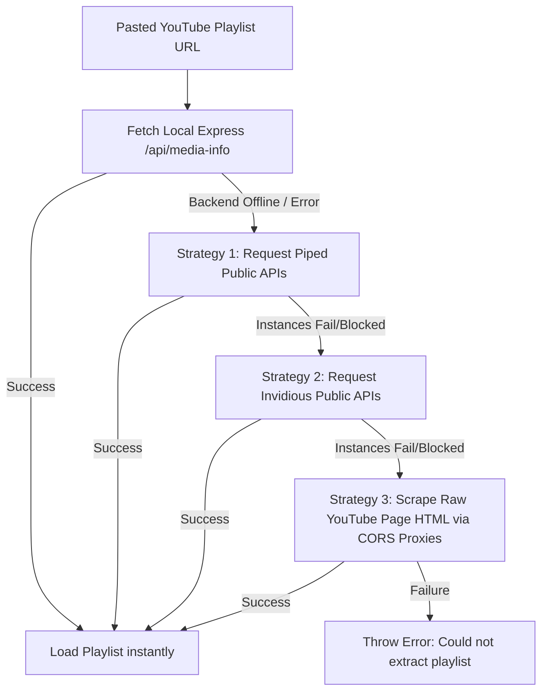
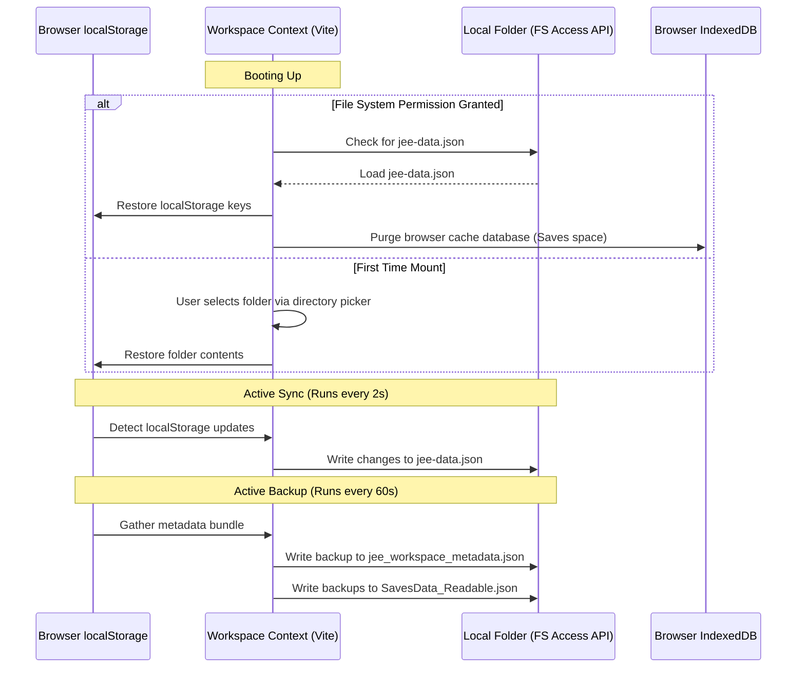

# JEE Prep Hub — Premium Study & Productivity Suite

JEE Prep Hub is an advanced study dashboard and productivity workspace custom-tailored for students preparing for competitive examinations (specifically the JEE exam). Built with a state-of-the-art tech stack, this application features full offline capability via the **File System Access API**, programmatic audio synthesis, spaced repetition question engines, browser-based OCR math crop suites, ambient noise mixers, visual graphing calculator widgets, interactive physics/chemistry canvases, and an intelligent double-fallback YouTube parsing system for both local server and purely static server builds.

---

## Table of Contents
1. [Key Architectural Designs](#key-architectural-designs)
2. [Global Layout & UI Shell Components](#global-layout--ui-shell-components)
3. [Page-by-Page Feature Matrix](#page-by-page-feature-matrix)
4. [Interactive AI Companion & Simulation Widgets](#interactive-ai-companion--simulation-widgets)
5. [Single-File Express Server Architecture (`server.js`)](#single-file-express-server-architecture-serverjs)
6. [Multi-Stage Static Playlist Fetching Algorithm](#multi-stage-static-playlist-fetching-algorithm)
7. [Workspace Local Directory Synchronizer](#workspace-local-directory-synchronizer)
8. [Offline Local Storage & Cache Purification](#offline-local-storage-cache-purification)
9. [Low-Level Helpers & Custom Synthesizers](#low-level-helpers--custom-synthesizers)
10. [Getting Started & Development Guides](#getting-started--development-guides)
11. [Workspace Dependency Breakdown](#workspace-dependency-breakdown)

---

## Key Architectural Designs

### 1. Unified Concurrent Architecture
The application runs both the Vite React frontend and the Express REST/media-streaming backend in a unified repository structure. Running `pnpm run dev` starts both servers concurrently on:
* **Frontend Dev Server**: Port `21847` (Vite)
* **Backend API Server**: Port `8080` (Express)

### 2. Dual Build-Target Capability
The workspace supports both:
1. **Static Build Output (`dist/`)**: Runs purely inside client browsers. If the backend Express server on port 8080 is offline, the client application activates robust client-side API proxies, scraping HTML pages natively in-browser and extracting media tracks directly.
2. **Single-Process Production Build**: Runs the compiled static frontend served from Node/Express statically, with SPA routing mapping all wildcards back to `index.html`.

---

## Global Layout & UI Shell Components

### 1. Command Palette
* **Trigger**: Activated by hitting `Ctrl + K` or `Cmd + K` on the keyboard (safely disabled in Focus Lockdown mode).
* **Location**: [src/App.tsx](file:///workspaces/JeeAppv9/artifacts/jee-prep/src/App.tsx#L64-L122).
* **Features**: Smooth Framer-Motion slide-in modal with fuzzy searching over 10 active pages:
  * *Dashboard*, *Calendar & Tags*, *Focus Music*, *PDF Viewer*, *Videos*, *Movie Hub*, *Admin Panel*, *Saves & Flashcards*, *AI Chat*, *Zen Mixer*.

### 2. Collapsible Navigation Sidebar
* **Location**: [src/components/Sidebar.tsx](file:///workspaces/JeeAppv9/artifacts/jee-prep/src/components/Sidebar.tsx).
* **Features**: A space-conscious vertical navigation sidebar that supports full collapsing to icons, animated hover states, dynamic route selection indicators, and responsive mobile drawers.

### 3. TopBar & Theme Engine
* **Location**: [src/App.tsx](file:///workspaces/JeeAppv9/artifacts/jee-prep/src/App.tsx#L124-L171).
* **Features**: Displays the current page tag and handles dynamic dark/light mode switches, storing state in `localStorage` under the `"theme"` key. When Focus Lockdown Mode is active, a red-pulsing badge shows the time remaining.

### 4. Floating Mini-Players
* **Audio MiniPlayer**: [src/components/MiniPlayer.tsx](file:///workspaces/JeeAppv9/artifacts/jee-prep/src/components/MiniPlayer.tsx) stays persistent at the bottom of the layout, managing playback states, volume, track timeline seek-scrubbing, and visualizer nodes.
* **Video Picture-in-Picture Player**: [src/components/VideoMiniPlayer.tsx](file:///workspaces/JeeAppv9/artifacts/jee-prep/src/components/VideoMiniPlayer.tsx) detaches from the main lecture page, floating over other dashboard sections so students can review notes or schedules while keeping the lecture visual in sight.

---

## Page-by-Page Feature Matrix

### 1. Dashboard (Home)
* **File Location**: [src/pages/HomePage.tsx](file:///workspaces/JeeAppv9/artifacts/jee-prep/src/pages/HomePage.tsx).
* **High-Precision Exam Countdown**: A retro-style digital flip-clock widget. Users can input target exam dates (e.g. JEE Main/Advanced) and time targets, which are parsed and updated down to the second.
* **Daily Activity Streak Tracker**: Linked to the [src/context/StreakContext.tsx](file:///workspaces/JeeAppv9/artifacts/jee-prep/src/context/StreakContext.tsx) API. Plots a visual representation of the consecutive study streak (including last active markers, active dates list, and bonus multiplier triggers).
* **Todo Planner**: Located in [src/components/TodoSystem.tsx](file:///workspaces/JeeAppv9/artifacts/jee-prep/src/components/TodoSystem.tsx). Features dragging list groups, prioritizing task rows (High, Medium, Low), allocating calendar tags, and tracking checkboxes.
* **Integrated Day Schedule**: Fetches schedule tags and timeline slots from the calendar database and dynamically overlays them onto today's view.
* **Focus Lockdown Mode**: Configured in [src/context/LockdownContext.tsx](file:///workspaces/JeeAppv9/artifacts/jee-prep/src/context/LockdownContext.tsx). Allows locked time sessions. During this timer, a dark translucent overlay blocks out navigation links, distracting widgets, and keyboard page navigation shortcuts.
* **Custom Layout Heights**: Height partitions of the Todo and Calendar containers on the home page can be adjusted by dragging handles (using [src/components/ResizableSection.tsx](file:///workspaces/JeeAppv9/artifacts/jee-prep/src/components/ResizableSection.tsx)), with values automatically saved in `localStorage`.

### 2. PDF Library & Annotator
* **File Location**: [src/pages/PDFPage.tsx](file:///workspaces/JeeAppv9/artifacts/jee-prep/src/pages/PDFPage.tsx).
* **Document Tree Hierarchy**: Organize PDF study sheets, books, and practice tests into customized Sections, Sub-sections, and individual files.
* **Drawing & Notation Canvas**: Custom pen drawing layers overlaying the PDF rendering engine. Includes:
  * *Tools*: Pen, Highlighter, Arrow, Text boxes, Rectangle outline, Circle, Triangle, and Eraser brush.
  * *Customizations*: Stroke thickness sliders and a custom hex/color picker that saves chosen colors directly to the database.
* **Visual Bounding Box Cropper**: Drag a bounding box over any section of a PDF sheet (such as a math question). The cropped area is saved as an image snippet directly in the Saves/Question Bank database.
* **Import Targets**: Directly uploads local files, processes image scans, or fetches online PDFs bypassing CORS blocks via the `/api/search` proxy.

### 3. Video Lecture Suite
* **File Location**: [src/pages/VideoPage.tsx](file:///workspaces/JeeAppv9/artifacts/jee-prep/src/pages/VideoPage.tsx).
* **Dual Rendering Engines**: Supports both native local HTML5 video playback for uploaded files (using `hls.js` streams) and distraction-free YouTube video playback.
* **Timestamped Study Notes**: Allows clicking to add study notes directly tied to video timeline positions. The rich note card supports:
  * *Rich text*: Markdown structures.
  * *Voice notes*: Integrates a microphone recorder that stores recorded voice blocks directly in database storage.
  * *Video screenshot snapshots*: Captures frames from the canvas playback buffer.
* **A-B Looping Controller**: Marks custom starting (`A`) and ending (`B`) points on a lecture timeline. When enabled, the player loops that segment continuously (ideal for reviewing complex derivations).
* **Controls**: Dynamic playback speeds (up to `8x` rate), video quality controls, subtitles, and track selection.

### 4. Saves (Question Bank)
* **File Location**: [src/pages/SavesPage.tsx](file:///workspaces/JeeAppv9/artifacts/jee-prep/src/pages/SavesPage.tsx).
* **Taxonomy System**: Organizes question snippets under Subjects (*Physics, Chemistry, Maths*) and custom chapter folders.
* **Metadata Editor**: Allows users to attach written solutions, question tags, Spaced Repetition status, correct/incorrect markers, and flags.
* **Browser OCR Engine**: Integrates `Tesseract.js` directly within the browser tab. Extracts text and equations from cropped question images automatically.
* **Spaced Repetition System (SRS)**: Implements custom review interval timers (e.g. 1 day, 3 days, 7 days) and logs memory decay stats over time.
* **Export PDF Sheets**: Packages cropped question images, answers, and explanations into a clean, printable PDF study package.

### 5. Focus Music & Zen Mixer
* **Music Hub**: Located in [src/pages/MusicPage.tsx](file:///workspaces/JeeAppv9/artifacts/jee-prep/src/pages/MusicPage.tsx). Features playlists for local MP3 uploads, audio track URLs, and YouTube search results.
* **Zen Ambient Mixer**: Located in [src/components/AmbientMixer.tsx](file:///workspaces/JeeAppv9/artifacts/jee-prep/src/components/AmbientMixer.tsx). Manages simultaneous loops for ambient soundscapes (White Noise, Rain, Coffee Shop, Forest, Waves). Each channel has its own mute toggle, volume slider, and fade transition.
* **Merged Youtube Audio Fetching**: Search terms or copy-pasted video/playlist URLs in the search bar are dynamically routed to fetch individual tracks or extract entire playlists instantly.

### 6. Calendar Page
* **File Location**: [src/pages/CalendarPage.tsx](file:///workspaces/JeeAppv9/artifacts/jee-prep/src/pages/CalendarPage.tsx).
* **Grids**: Multi-tab schedule layouts supporting Monthly planner views, Weekly grids, and Daily agenda timelines.
* **Color Tagging**: Color tags represent different task domains (e.g., classes, self-study, mock tests). Recurring patterns (daily, weekly, custom days) are supported.
* **Timers & Countdown Alarms**: Custom study timers and alarm clocks with custom synthesizer sound triggers.

### 7. Movie Hub (Study Breaks)
* **File Location**: [src/pages/MovieHub.tsx](file:///workspaces/JeeAppv9/artifacts/jee-prep/src/pages/MovieHub.tsx).
* **TMDB Integration**: Browse trending movies, search for series, and track personal watch lists.
* **Multi-Node Embed Player**: Automatically cycles through 5 distinct iframe streaming nodes (*Vidking, 2Embed, XPS, VidSrc Pro, Hindi Multi-Audio*) to ensure uninterrupted streaming.
* **Focus-Hijack Blur Interception**: A specialized window event handler prevents redirect pages from hijacking user focus:
  ```typescript
  useEffect(() => {
    if (!playing) return;
    const handleWindowBlur = () => {
      setTimeout(() => {
        if (document.activeElement instanceof HTMLIFrameElement) {
          window.focus();
        }
      }, 50);
    };
    window.addEventListener("blur", handleWindowBlur);
    return () => window.removeEventListener("blur", handleWindowBlur);
  }, [playing]);
  ```

### 8. Admin Page
* **File Location**: [src/pages/AdminPage.tsx](file:///workspaces/JeeAppv9/artifacts/jee-prep/src/pages/AdminPage.tsx).
* **Journey Milestones**: Log mock test scores, study targets, milestones, and rank predictions.
* **Analytics**: Plots Recharts metrics showing study hours, daily task completion rates, page-by-page time allocation, and music streams.
* **Workspace Key Rings**: Custom interfaces to register and rotate API key configurations:
  * *OpenRouter API Keys* (for AI model chat interactions and embeddings).
  * *TMDB API Keys* (to bypass global rate limits on movie indexes).
  * *ElevenLabs Voice Configurations* (to authorize high-quality voice audio conversions).
* **Storage Performance Monitoring**: Real-time measurements of JS memory heap sizes, DOM frames-per-second main-thread loads, and `localStorage` storage allocations.

---

## Interactive AI Companion & Simulation Widgets

### 1. Interactive Chat Interface
* **File Location**: [src/pages/AI.tsx](file:///workspaces/JeeAppv9/artifacts/jee-prep/src/pages/AI.tsx).
* **Description**: A comprehensive chatbot dashboard connected to OpenRouter models (Qwen, Llama, Hermes, Gemma).
* **Features**:
  * *LaTeX Equations*: Fully processes inline math formulas (wrapped in `$`) and block equations (wrapped in `$$`) via KaTeX.
  * *Image Draw Editor*: Upload drawing sheets or math question images. Before sending, click to draw vectors, crop boundaries, or point out equations on the canvas.
  * *Custom LLM Markdown Widgets*: Renders interactive widgets dynamically if the LLM responds with specialized JSON blocks (e.g. `type: "simulation"` or `type: "plot"`).

### 2. Specialized Interactive Widgets
The custom widgets are defined in [src/components/AICustomWidgets.tsx](file:///workspaces/JeeAppv9/artifacts/jee-prep/src/components/AICustomWidgets.tsx):

| Widget Name | Renders | Key Inputs & Interactive Controls | Math/Physics Calculations |
| :--- | :--- | :--- | :--- |
| **`GraphWidget`** | Interactive Cartesian Graph Canvas | Text function input (e.g., `sin(x) * 2`), custom sliders for constants, graph coordinate click-and-drag panning, zoom buttons | Decodes inline math syntax, evaluates equations natively, displays real-time `x/y` coordinates on mouse pointer hover |
| **`SimulationWidget`** (Projectile) | Animated projectile trajectory paths | Launch angle (0° to 90°), initial velocity slider ($v_0$), local gravity ($g$), launch height ($h$) | Calculates total flight time ($t = \frac{v_{0y} + \sqrt{v_{0y}^2 + 2gh}}{g}$), horizontal range, and peak coordinate height |
| **`SimulationWidget`** (Density) | Water beaker containing blocks | Block mass slider ($m$), block volume slider ($V$), fluid density selector ($\rho_f$) | Evaluates object density ($\rho_b$). Simulates buoyancy immersion level, downward gravity force vector, and upward buoyant force ($F_b = \rho_f V_{\text{disp}} g$) |
| **`SimulationWidget`** (Electricity) | Closed circuit diagram schematic | Battery voltage ($V$), circuit resistor value ($R$) | Evaluates current ($I = \frac{V}{R}$) and power dissipation ($P = I^2 R$). Animates electron flow speed along wire nodes based on calculated current |
| **`SimulationWidget`** (Bohr Model) | Bohr atom with electrons orbiting | Orbits transition selectors ($n=1$ to $n=5$) | Electron transitions trigger wavelet animations. Photon energy wavelength is calculated using the Rydberg energy relation ($\lambda = \frac{1240}{\Delta E}$ nm) |
| **`SimulationWidget`** (Bonding) | Animated atomic bonding orbital structures | Molecular selection toggles (water $H_2O$, carbon dioxide $CO_2$, salt $NaCl$) | Renders 2D visual layouts of shared covalent electron clouds or ionic charge transfers between atomic rings |
| **`SimulationWidget`** (SHM) | Oscillating pendulum or bouncing spring | Pendulum length ($L$), mass ($m$), spring constant ($k$), initial amplitude angle | Toggles between pendulum and spring mass oscillations. Plots velocity vs displacement phase diagrams and updates kinetic vs potential energy charts |
| **`InteractiveQuizWidget`** | Multi-choice card question widget | Clickable option buttons | Validates answers instantly and displays detailed step-by-step explanations |
| **`YouTubeCardWidget`** | Study video recommended row | Structured YouTube description layouts | Displays custom descriptions, view counts, ratings, and creator badges |
| **`NewsFeedWidget`** | Renders study resources | Lists recommended articles and study resources | Categorizes links by subject, and displays favicons |

### 3. AI Quiz Test Sheet Generator
* **File Location**: [src/pages/QuizPage.tsx](file:///workspaces/JeeAppv9/artifacts/jee-prep/src/pages/QuizPage.tsx).
* **Description**: Spawns customized multiple-choice tests on Physics, Chemistry, and Maths using LLMs.
* **Features**:
  * *Exclusions*: Generates questions targeting specific subjects based on selected contexts, chapters, or files (PDFs, Videos, URLs).
  * *Snippet Matching*: Adapts question structures from the bookmarked saves library, matching parent `sourceQuestionId` keys to retain original diagrams and images:
  * *JEE Test Layout*: Replicates the official JEE computer-based exam platform palette. Features color-coded status badges for question states:
    * **Answered Shape**: Green polygon (`polygon(0 0, 100% 0, 100% 70%, 50% 100%, 0 70%)`).
    * **Not Answered Shape**: Red polygon.
    * **Not Visited Shape**: Grey square.
    * **Marked for Review Shape**: Purple circle.
    * **Answered & Marked for Review Shape**: Purple circle with a small green badge.

---

## Single-File Express Server Architecture (`server.js`)

The backend is packaged inside [server.js](file:///workspaces/JeeAppv9/artifacts/jee-prep/server.js). It manages REST operations and stream piping.

### 1. Unified Route Endpoints

#### `GET /api/healthz`
Returns `{ "status": "ok" }` for health monitoring.

#### `GET /api/search?q=QUERY`
DuckDuckGo search scraper. Fetches raw HTML search result pages and extracts OpenGraph titles and thumbnail image attributes (`og:image`) concurrently to create visual link cards in the React UI.

#### `GET /api/yt-search?q=QUERY`
Resolves YouTube search requests. It uses the `play-dl` client API, falling back to a raw YouTube page parser if the API is rate-limited.

#### `GET /api/stream?url=YT_URL`
YouTube audio streaming engine. Spawns `yt-dlp` as a piped standard output stream. It caches downloaded audio chunks in an in-memory buffer (`audioCache`) to handle subsequent byte-range seek requests without reloading the source:
```typescript
const ytdlp = spawn("yt-dlp", [
  "-f", "bestaudio/best",
  "--no-playlist",
  "--quiet",
  "--no-warnings",
  "-o", "-",
  ytUrl,
]);
```

#### `GET /api/media-info?url=MEDIA_URL`
Retrieves detailed metadata:
* **YouTube Video URL**: Fetches titles, descriptions, lengths, and thumbnails.
* **YouTube Playlist URL**: Fetches all video references. Returns up to the first 100 tracks in under 1 second.
* **Spotify track/playlist/album URL**: Extracts track metadata and queries YouTube to find matching audio streaming links.

### 2. Express 5 Wildcard Compatibility
Express v5 uses the newer `path-to-regexp` v8 parser, which throws path errors for wildcard strings like `"*"` and `"/*"`. To bypass compilation constraints and ensure path routing stability, catch-all routes at the bottom of the server use a direct JavaScript regular expression object:
```typescript
app.get(/.*/, (req, res) => {
  res.sendFile(path.join(__dirname, "dist", "index.html"));
});
```

---

## Multi-Stage Static Playlist Fetching Algorithm

If the backend Express server on port 8080 is offline (e.g. when hosting the app as a static build on GitHub Pages), the client-side code automatically routes YouTube video and playlist URL imports through a robust client-side multi-stage fallback queue:



### Fallback Strategies Details

#### Strategy 1: Piped API Fallback
Queries five public Piped instances concurrently:
* `kavin.rocks`, `smnz.de`, `lunar.icu`, `adminforge.de`, `tokhmi.xyz`

#### Strategy 2: Invidious API Fallback
Queries five public Invidious instances concurrently:
* `jing.rocks`, `puffyan.us`, `privacydev.net`, `tux.pizza`, `lunar.icu`

#### Strategy 3: Client CORS Proxy Scraper (With Original Video Titles)
Fetches raw YouTube HTML pages via public CORS-bypass proxies:
* `allorigins.win`, `codetabs.com`, `corsproxy.io`
* Parses video links (`/watch?v=ID`) and extracts the original video titles from the `title` attributes on scraped elements. Titles are decoded in the browser, avoiding generic renames like `"Video 1"`, `"Video 2"`, etc.

---

## Workspace Local Directory Synchronizer

* **Context File**: [src/context/WorkspaceContext.tsx](file:///workspaces/JeeAppv9/artifacts/jee-prep/src/context/WorkspaceContext.tsx).
* **Automatic Synchronization**: [src/App.tsx](file:///workspaces/JeeAppv9/artifacts/jee-prep/src/App.tsx#L173-L245).
* **Description**: Integrates local workspace directories using the **File System Access API** (`showDirectoryPicker`).

### Workspace Synchronization Flow



---

## Offline Local Storage & Cache Purification

Once a local folder is mounted, the workspace purging routine clears heavy binary contents (such as PDF files, drawings, video screenshot frames, and voice recordings) from the browser's IndexedDB, keeping the browser storage footprint minimal (~3KB).

### Keys Saved to `jee-data.json`
* Prefixes: `jee_`
* Prefixes: `pdf_anno_`
* Theme selection: `theme`
* Synced profile login: `user`

---

## Low-Level Helpers & Custom Synthesizers

### 1. Programmatic Web Audio Synthesizer
* **File Location**: [src/utils/audio.ts](file:///workspaces/JeeAppv9/artifacts/jee-prep/src/utils/audio.ts).
* **Description**: Generates audio notifications programmatically using the browser's **Web Audio API** (`AudioContext`).
* **Synthesized Audio Patterns**:
  * *Timer Done Ring*: A triple-beep tone sequence (880Hz, 880Hz, 1100Hz with volume scaling).
  * *Alarm Ring*: An alternating dual-tone pattern (960Hz and 760Hz) repeating 5 times.
  * *Anti-Clipping*: Uses linear and exponential volume ramps to prevent speaker popping/clicking:
    ```typescript
    g.gain.setValueAtTime(0, startTime);
    g.gain.linearRampToValueAtTime(scaledGain, startTime + 0.01);
    g.gain.exponentialRampToValueAtTime(0.0001, startTime + duration);
    ```

### 2. Time Tracker Tracker
* **File Location**: [src/App.tsx](file:///workspaces/JeeAppv9/artifacts/jee-prep/src/App.tsx#L247-L326).
* **Description**: Tracks student study time across different sections of the app.
* **Features**:
  * Tracks study time per page (e.g. PDF Annotator, Videos, saves, Chat) in real-time.
  * Automatically saves data to `localStorage` under `jee_time_tracking` at 30-second intervals or when the tab is closed/hidden.

### 3. Text-to-Speech (TTS) Engine
* **File Location**: [src/hooks/useTTS.ts](file:///workspaces/JeeAppv9/artifacts/jee-prep/src/hooks/useTTS.ts).
* **Description**: Provides text-to-speech audio streaming for questions and study cards.
* **Flow**:
  1. *ElevenLabs API*: If configured, streams high-quality audio from ElevenLabs (`https://api.elevenlabs.io`).
  2. *Native Speech Fallback*: If the API key is missing, falls back to the native Web Speech API (`speechSynthesis`), prioritizing Hindi (`hi-IN`) and English (`en-US`) voices.

### 4. RAG Semantic Embedding & Search Reranker
* **File Location**: [src/utils/embedding.ts](file:///workspaces/JeeAppv9/artifacts/jee-prep/src/utils/embedding.ts).
* **Description**: Generates vector embeddings to support semantic search.
* **Key Functions**:
  * *Vector Generation*: Calls the OpenRouter Embeddings API using the `nvidia/llama-nemotron-embed-vl-1b-v2:free` model.
  * *Similarity Calculation*: Computes cosine similarity between text vectors to rank relevant search results.
  * *Offline Fallback*: Automatically falls back to a Jaccard token overlap algorithm if the network is offline.

---

## Getting Started & Development Guides

### 1. Install Dependencies
Run from the root workspace directory:
```bash
pnpm install
```

### 2. Launch Development Servers
Start both the Express API and Vite React client concurrently:
```bash
pnpm run dev
```

### 3. Build Static Assets
Compile the React frontend app:
```bash
pnpm run build
```
Static production files will be output to the `dist/` directory.

### 4. Start Production Server
Launch the Express backend to serve the static frontend bundle:
```bash
NODE_ENV=production node server.js
```

---

## Workspace Dependency Breakdown

### Express Core & Streaming Backend
* `express`: Web server framework.
* `cors`: Cross-Origin Resource Sharing.
* `play-dl`: YouTube search and metadata resolver.
* `@distube/ytdl-core`: YouTube streaming media tool.

### React Core & Client Interfaces
* `react` & `react-dom`: Component layout engines.
* `wouter`: Lightweight router for Single Page Apps (SPA).
* `framer-motion`: Motion and transition animations.
* `lucide-react`: SVG icon library.
* `@tanstack/react-query`: Server state synchronization.

### Data Manipulation & File Sync
* `jszip`: Compresses binary backups into zip files.
* `katex` & `rehype-katex`: Mathematical symbol and equation rendering.
* `react-markdown`: Renders text components dynamically.
* `recharts`: Studying time statistics and tracking charts.