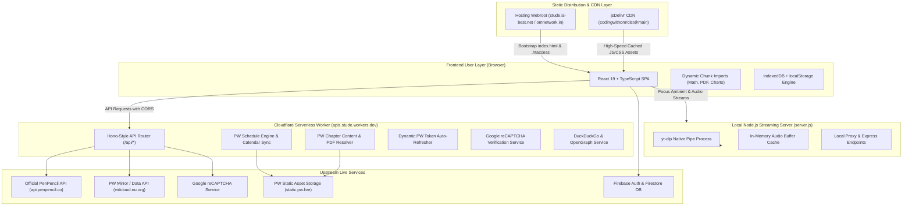

# 🚀 JEE Prep Platform — Master System Architecture & Complete App Manual

> **Comprehensive Documentation**: A complete technical and operational guide covering all features from Physics Wallah curriculum extraction, YouTube audio streaming, AI doubt solver, Question Bank, Test Series, and Admin dashboard, to Cloudflare Worker serverless backend, CDN asset hosting, security, and authentication.

---

## 📌 1. High-Level System Architecture

The JEE Preparation Platform (`JeeAppv9`) is engineered as a modern, high-performance, distributed Single Page Application (SPA). To bypass free-tier web hosting limitations (e.g., InfinityFree file count and bandwidth quotas), the application utilizes a **Tri-Tier Architecture**:



---

## 🔑 2. Physics Wallah (PW) Engine — Deep Dive

The platform provides a seamless, authentic Physics Wallah learning experience with live batch navigation, curriculum breakdown, video lectures, DPP sheets, and class notes.

### 2.1 Dynamic Authentication & Token Lifecycle
* **Endpoint**: `/api/pw-token`
* **Mechanism**:
  - The worker retrieves an authenticated bearer token from `https://vidcloud.eu.org/generate_token.php`.
  - Tokens are cached in-memory with a TTL of 1 hour.
  - If any upstream call yields a `401 Unauthorized` or empty payload, the worker triggers an immediate cache invalidation and retries with a fresh token or pre-configured high-availability backup token (`BACKUP_PW_TOKEN`).

### 2.2 PW Schedule & Monthly Calendar Synchronization
* **Endpoints**: `/api/pw-schedule`, `/api/pw-batch-schedule`
* **Query Parameters**: `batchId`, `date` (`YYYY-MM-DD`), `month` (`YYYY-MM`)
* **Key Enhancements**:
  - **Month Alignment**: Whenever a specific date (e.g. `2026-05-18`) is requested, the system automatically derives `targetMonth = date.slice(0, 7)` (`2026-05`). This prevents range mismatches where requests for past or future dates would default to the current month.
  - **Paginated Range Fetching**: Queries `weekly-schedules` across pages 1..12 in non-flooding chunks of 4.
  - **Free Schedule Merge**: Concurrently queries `${PW_OFFICIAL_API}/v3/public/batch-service/batch-subject-schedules/${batchId}/free-schedule` to merge official free sessions.
  - **Curriculum Synthesizer Fallback**: If live feeds are temporarily unreachable (e.g., upstream 502), the server generates a structured timetable based on the batch's real subjects, teachers, and chapters across the date range.
  - **Calendar UI Sync**: Clicking a date in the weekday strip, calendar grid, or active prompt synchronizes both `selectedScheduleDate` and `calendarMonth`, guaranteeing instantaneous timetable updates.

### 2.3 Real PW PDF Attachment Resolution (DPPs & Notes)
* **Problem Solved**: Upstream PW attachment objects often return `key: ""` and `baseUrl: "https://static.pw.live/"`. Earlier fallbacks reverted to Google Search links when `key` was empty.
* **Resolution**:
  1. The server utilizes `fetchVideoAttachments` via `https://vidcloud.eu.org/data-api.php?action=attachments` for candidate lectures in controlled parallel chunks of 4.
  2. Authentic PDF URLs from `atts.notes[].pdf` and `atts.dpp_pdf[].pdf` (stored on `https://static.pw.live/5eb393ee95fab7468a79d189/ADMIN/...pdf`) are linked directly to each lecture, note, and DPP item.
  3. All synthetic Google Search links (`https://www.google.com/search?q=...`) have been completely removed.
  4. In the frontend client fallback (`fetchDirectChapterContents`), the app also queries `data-api.php?action=attachments` client-side so direct fetches also resolve genuine PW PDFs.
  5. The `openPdf` helper opens PDFs directly in the interactive in-app modal with zoom, download, and fullscreen capabilities.

### 2.4 State Persistence & Safe Batch Merging
* **`mergeBatches` Utility**: When batch metadata refreshes, loaded lectures inside `selectedSubject.chapters` are preserved and merged rather than overwritten by empty initial metadata.
* **Storage Layer**: When chapter contents finish loading, the updated batch tree is saved immediately to both `localStorage` (`pw_cached_batches`) and `IndexedDB` (`idbSet`), ensuring zero latency on revisit.

---

## 🎧 3. YouTube Search & Audio Streaming Engine

The platform provides a high-focus ambient study environment allowing users to stream background study beats and lofi audio.

### 3.1 Streaming Architecture (`server.js`)
* **Endpoint**: `/api/yt-stream?v=<VIDEO_ID>`
* **Mechanism**:
  - Spawns `yt-dlp` natively in headless mode:
    ```bash
    yt-dlp -f bestaudio/best --no-playlist --quiet --no-warnings -o - <ytUrl>
    ```
  - Directly pipes the stdout chunks to the HTTP response with `Content-Type: audio/webm` (or matching MIME).
  - Collects chunks into an in-memory buffer (`entry.buffer = Buffer.concat(entry.chunks)`). Subsequent requests for the same track are served instantaneously from RAM cache with HTTP 206 Partial Content range support.

### 3.2 YouTube Search & Multi-Engine Fallback
* **Endpoint**: `/api/yt-search?q=<QUERY>`
* **Pipeline**:
  1. Primary: Queries Invidious / Piped API mirrors for video IDs, titles, thumbnails, and channel data.
  2. Fallback: Uses DuckDuckGo HTML scraping with site filter `site:youtube.com/watch` to extract valid YouTube video identifiers.

### 3.3 Ambient Sound Mixer (`AmbientMixer.tsx`)
* **Features**:
  - Independent simultaneous sound channels: Binaural Alpha Waves, White Noise, Heavy Rain, Campfire, Coffee Shop, Forest Birds, Thunder.
  - Multi-track volume sliders with master mute and sleep timer.
  - Native Web Audio API synthesis and loop management.

---

## 🤖 4. AI Doubt Solver & LaTeX Math Engine

### 4.1 AI Doubt Solver
* **Features**:
  - Context-aware JEE problem solver: Aspirants can click "Ask AI" on any question from the Question Bank.
  - Prompts are automatically enriched with question text, options, subject, and chapter context.
  - Provides structured step-by-step solutions, key conceptual formulas, alternative shortcut methods, and common pitfall warnings.

### 4.2 Mathematical Rendering (KaTeX & MathJax)
* **KaTeX Integration**: High-speed synchronous inline (`$...$`) and block (`$$...$$`) LaTeX equation rendering via `vendor-math`.
* **MathJax Fallback**: For complex macros, multi-line arrays, and chemical equations, MathJax (`mathjax/tex-svg.js`) dynamically renders SVG vectors.

---

## 🛡️ 5. Authentication, Security & Google reCAPTCHA

### 5.1 Firebase Authentication & Account Protection
* **Providers**: Email/Password and Google OAuth popup (`signInWithPopup`).
* **Single Email Enforcement**: Queries Firestore (`db.collection("users").doc(user.uid)`) to verify that the email has not been registered under an conflicting local account.
* **Session Management**: Session persistence toggle with auto-expiration after inactivity.

### 5.2 Google reCAPTCHA Verification & Key Setup
* **Verification API**: `/api/verify-captcha`
  - Validates response tokens against `https://www.google.com/recaptcha/api/siteverify`.
  - Obfuscates secret keys using byte-array encoding to protect sensitive keys from discovery.

> [!IMPORTANT]
> **Correct Google reCAPTCHA Key Configuration**:
> If Google reCAPTCHA displays: `ERROR for site owner: Invalid key type`:
> 1. Visit the [Google reCAPTCHA Admin Console](https://www.google.com/recaptcha/admin).
> 2. Create a key with **reCAPTCHA v2 ("I'm not a robot" Checkbox)**. (Do NOT select v3 or Enterprise).
> 3. Under **Domains**, add:
>    - `stude.is-best.net`
>    - `omnetwork.in`
>    - `localhost`
>    - `127.0.0.1`
> 4. Use the generated Site Key in frontend and Secret Key in backend.

### 5.3 Resilient Human Check Fallback
* To eliminate deadlocks when reCAPTCHA keys are misconfigured or still propagating in Google's DNS, the login modal features an interactive **Human Security Check** (e.g. arithmetic verification).
* Users who solve the security challenge can verify and continue their Google Sign-In without being permanently blocked.

---

## 📚 6. Feature Matrix & Page Breakdown

| Page | Route | Key Functionalities |
| :--- | :--- | :--- |
| **Home Dashboard** | `#/` | Daily streak tracker, syllabus completion % dials, quick resume, daily study goals, recent questions. |
| **Physics Wallah** | `#/pw` | Batch selector, Subject tabs, Chapter content segregation (Lectures, Notes, DPPs), Live timetable, Month calendar, PDF modal viewer. |
| **Question Bank** | `#/questions` | 10,000+ JEE Main & Advanced questions, filters by Year (2019–2025), Subject, Chapter, Difficulty, Numerical/MCQ, LaTeX solutions. |
| **Test Series / Quiz** | `#/quiz` | Full Mock Tests & Chapter Drills, NTA-style CBT interface, Question Palette, countdown timer, marking scheme (+4/-1), detailed score analysis. |
| **Study Materials** | `#/materials` | Curated formula cheat sheets, mind maps, handbook summaries, and high-yield revision notes. |
| **Flashcards** | `#/flashcards` | Spaced repetition flashcards for Chemistry reactions, Physics definitions, and Math identities with flip animation. |
| **Music & Focus** | `#/music` | YouTube audio stream player, lofi beats, ambient sound mixer, Pomodoro timer (25m/5m). |
| **Saved / Bookmarks** | `#/saves` | Offline saved questions, marked DPPs, personal notes, and revision bookmarks. |
| **Admin Dashboard** | `#/admin` | System health overview, PW token inspector, cache purge, batch metadata re-fetcher, error logs. |

---

## 🚢 7. Build, CDN & Deployment Architecture

### 7.1 CDN Dynamic Rewriting
* The build command `VITE_USE_CDN=true npm run build` compiles Vite assets and generates `index.html` referencing assets from `https://cdn.jsdelivr.net/gh/codingwithom/dist@main/assets/...`.
* This completely offloads large JavaScript bundles (over 10 MB total) from the web host onto jsDelivr's global edge network.

### 7.2 Hosting Package (`index_only_for_hosting.zip`)
Contains all files required for uploading to web hosting (`public_html` / `htdocs`):
- `index.html`: Lightweight HTML bootstrap file referencing CDN scripts.
- `.htaccess`: Apache URL rewrite rules routing all virtual paths to `index.html` (SPA routing) with HTTPS enforcement.
- `logger.php`: Telemetry and error log collector.
- `sw.js` & `manifest.json`: Progressive Web App (PWA) configuration.
- `exam-icons/` & `mathjax/`: Static visual assets and math symbols.

### 7.3 Multi-Repository Architecture
1. **Main Codebase**: [`codingwithom/JeeAppv9`](https://github.com/codingwithom/JeeAppv9)
2. **Static Distribution Repo**: [`codingwithom/dist`](https://github.com/codingwithom/dist) (CDN source for jsDelivr)
3. **Cloudflare Worker Repo**: [`codingwithom/api-server`](https://github.com/codingwithom/api-server) (Deploys to `apis.stude.workers.dev`)

---

## 🛠️ 8. Maintenance & Verification Quick Reference

### Verifying Cloudflare Worker
```bash
# Test Batch Schedule (May 18 Date Test)
curl -s "https://apis.stude.workers.dev/api/pw-schedule?batchId=698ad3519549b300a5e1cc6a&date=2026-05-18" | jq .

# Test Chapter Contents & Static PW PDF Attachments
curl -s "https://apis.stude.workers.dev/api/pw-chapter-contents?batchId=698ad3519549b300a5e1cc6a&subjectId=69b5698ee506a608ee297ed1&chapterId=69dc843271d06abbf3869763" | jq .
```

### Verifying CDN Assets
```bash
# Check HTTP 200 on jsDelivr
curl -sI "https://cdn.jsdelivr.net/gh/codingwithom/dist@main/assets/index-8bxHwMXV.js" | head -n 5
```

---
*Created and maintained for JEE Aspirants.*
