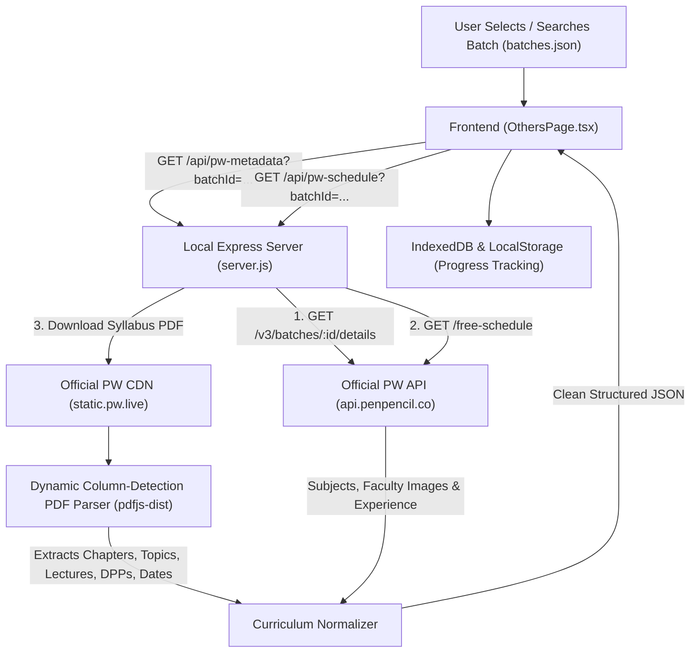

# Official Physics Wallah (PW) Live API Integration Guide

This guide documents the architecture and implementation for fetching live batch curricula, subjects, teachers, chapters, lectures, DPPs, PDF notes, and weekly schedules directly from **official Physics Wallah APIs** without third-party proxy services.

---

## 1. Architectural Philosophy

1. **Zero Pre-Written / Hardcoded Data:**
   - No chapters, subjects, teachers, or lectures are pre-saved inside the application codebase.
   - Whichever batch the user selects (JEE, NEET, Foundation, Board, Dropper, etc.), all subjects, teachers, chapters, lecture sequences, and DPPs are dynamically fetched live from PW.

2. **No Third-Party Scraping or Proxies:**
   - All legacy dependencies on `vidcloud.eu.org` and custom auth proxy endpoints have been completely eliminated.
   - Public batch discovery uses the static catalog `https://studystark.github.io/batches/batches.json` solely to search batch names and batch IDs.
   - All subsequent batch metadata, faculty profiles, syllabus planners, and schedules query official Physics Wallah systems directly (`api.penpencil.co` / `static.pw.live`).

3. **Strict No-Video Policy:**
   - As mandated, video players, video embeds, watch modals, and third-party streaming links are not used.
   - The interface is exclusively dedicated to **Study Tracking, Curriculum Roadmaps, DPP Practice, and Official PDF Notes**.

---

## 2. System Architecture

---

## 3. Official Physics Wallah Endpoints Used

### 3.1 Batch Details & Faculty Profiles
- **Endpoint:** `GET https://api.penpencil.co/v3/batches/${batchId}/details?type=EXPLORE_LEAD`
- **Required Headers:**
  - `client-id: 5eb393ee95fab7468a79d189`
  - `client-type: WEB`
  - `User-Agent: Mozilla/5.0 ...`
- **Authentication:** Public / Unauthenticated (`EXPLORE_LEAD` flow).
- **Data Extracted:**
  - Batch Name, Target Exam, Class, Description, Fee, Preview Image.
  - `subjects`: Array of subjects included in the batch.
  - Teachers per subject: Name, Qualifications, Experience, and Profile Image URL (`https://static.pw.live/${t.imageId.key}`).
  - `remoteSubject.fileId`: Official batch Syllabus & Lecture Planner PDF hosted on `static.pw.live`.

### 3.2 Live & Upcoming Class Schedule
- **Endpoint:** `GET https://api.penpencil.co/v3/public/batch-service/batch-subject-schedules/${batchId}/free-schedule`
- **Required Headers:**
  - `client-id: 5eb393ee95fab7468a79d189`
  - `client-type: WEB`
- **Data Extracted:**
  - Scheduled classes with start and end times in IST.
  - Subject name and teacher names.
  - Lecture topic and chapter tags (`tags[0].name`).
  - DPP tags and class notes attachments.

### 3.3 Public Batch Catalog
- **URL:** `https://studystark.github.io/batches/batches.json`
- **Purpose:** Fast client-side catalog search across thousands of public PW batches (JEE, NEET, CBSE, UPSC, NDA, etc.) by name, exam, or batch ID.

---

## 4. Dynamic Syllabus & Lecture Planner Parser

Because Physics Wallah batches publish their comprehensive curriculum structure via official PDF planners attached to the batch record (`remoteSubject.fileId` on `static.pw.live`), `server.js` includes a server-side parser powered by `pdfjs-dist`:

1. **Header Coordinate Detection:**
   - Scans the first page of the PDF to locate bounding boxes for columns: `Chapter`, `Topic / Subtopic`, `Lecture No`, `Planned Date`, `Faculty`, and `DPP / Questions`.
   - Dynamically calculates horizontal split midpoints so arbitrary column widths and page layouts across different academic years are automatically adapted.

2. **Row & Item Extraction:**
   - Groups text items by vertical coordinates (`y`), splitting tokens into their respective column bins based on horizontal coordinate (`x`).
   - Automatically detects:
     - Chapter Names
     - Lecture Titles (e.g. `Lec 01: Units and Measurement`)
     - Paired Daily Practice Problems (DPPs) with question counts
     - Faculty Names
     - Scheduled Completion Dates

3. **Fallback to Schedule Aggregator:**
   - If a batch does not attach a planner PDF, the system aggregates chapters and topics dynamically from the batch's live weekly schedule feed (`batch-subject-schedules/${batchId}/free-schedule`).

---

## 5. Local Study Progress Tracking

All study tracking happens in the student's browser and is persistent across reloads:
- **Storage:** Synced between `localStorage` and `IndexedDB` (`pw_completed_lectures`).
- **Granular Checkboxes:** Students toggle checkboxes for theory lectures and DPP problem sets independently.
- **Auto-Calculated Metrics:**
  - Total batch progress percentage.
  - Subject-level completion bars.
  - Chapter-level completion progress (e.g. `12 / 14 Completed`).
- **Official Notes:** Direct buttons open the official PDF notes (`static.pw.live`) without video interruptions.
