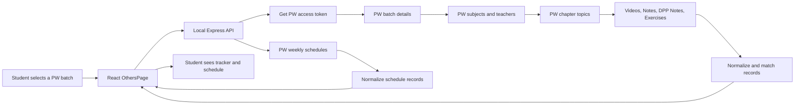

# Physics Wallah (PW) Metadata Integration Guide

This document explains, in beginner-friendly language, how the JEE Prep Hub reads Physics Wallah batch information and displays it in the app.

The feature is designed for study tracking. It reads publicly available batch and learning metadata through the application's backend, then displays batch subjects, teachers, chapters, lectures, DPPs, PDFs, and class schedules in the frontend.

## 1. Where The Feature Lives

The PW tracker is mainly implemented in two files:

- `artifacts/jee-prep/server.js`
  - Runs the Express backend.
  - Contacts the PW metadata service.
  - Handles authentication tokens.
  - Fetches and combines lectures, notes, DPPs, exercises, and schedules.
  - Sends a clean, smaller response to the browser.

- `artifacts/jee-prep/src/pages/OthersPage.tsx`
  - Runs the React frontend page.
  - Lets the student search and select a batch.
  - Displays subjects, teachers, chapters, lectures, DPPs, PDFs, and schedules.
  - Stores completed lecture and DPP checkmarks locally.

The browser normally calls only the local application routes:

```text
/api/pw-metadata
/api/pw-schedule
```

The backend calls the protected upstream metadata endpoints. This is important because browsers may block direct requests to the upstream service because of CORS or authentication rules.

## 2. Simple Data Flow



In simple terms:

1. The student chooses a batch.
2. The frontend asks the local backend for metadata.
3. The backend obtains a temporary access token.
4. The backend fetches the batch information from the upstream service.
5. The backend organizes the raw records into subjects, chapters, lectures, and DPPs.
6. The frontend displays the organized data.

## 3. Sources Used

### 3.1 Public batch catalog

```text
https://studystark.github.io/batches/batches.json
```

This catalog is used to show searchable batch names and IDs. A catalog item normally contains fields such as:

- `batch_id`
- `name`
- `byName`
- `exam`
- `class`
- `language`
- `start_date`
- `end_date`

The frontend uses the batch ID from this catalog to request detailed information.

This catalog is only the batch selector source. It does not provide the complete chapter and lecture list.

### 3.2 Temporary access token

```text
https://vidcloud.eu.org/generate_token.php
```

The backend requests a temporary token from this endpoint. The response may provide the token as either:

```json
{
  "access_token": "..."
}
```

or:

```json
{
  "token": "..."
}
```

The backend accepts both names.

The token is kept in memory for approximately one hour. A fallback copy is also stored temporarily at:

```text
/tmp/pw_token.txt
```

The token is never sent to the React page. Only normalized metadata is returned to the browser.

### 3.3 Batch details

```text
https://vidcloud.eu.org/api/v3/batches/{batchId}/details?type=EXPLORE_LEAD
```

This endpoint gives the subjects belonging to a batch. The backend reads:

- Subject name
- Subject ID
- Teacher IDs
- Teacher first and last names

Example conceptual result:

```text
Batch
  Subject: Physics
    Teacher: Rajwant Singh Sir
  Subject: Maths
    Teacher: Amarnath Anand Sir
```

The subject ID is needed for the next requests.

### 3.4 Chapter/topic list

```text
https://vidcloud.eu.org/api/v2/batches/{batchId}/subject/{subjectId}/topics?page={page}
```

Each topic is treated as a chapter or chapter-like group. The backend reads:

- Topic ID: `_id`
- Chapter name: `name`
- Pagination information

The backend requests multiple pages until all topics are loaded or the upstream service reports that there are no more pages.

Some administrative or non-study topic names are ignored, for example:

- Only PDF
- Only Video
- Demo Videos
- Short Notes
- Mind Maps
- Blueprint
- Notice
- Announcement
- Test Series

## 4. How Lectures Are Loaded

The lecture feed is requested from:

```text
https://vidcloud.eu.org/api/v2/batches/{batchId}/subject/{subjectId}/contents?page={page}&contentType=videos
```

The backend reads lecture information such as:

- Content ID: `_id`
- Lecture title: `topic`
- Chapter tags: `tags`
- Video duration: `videoDetails.duration`
- Date: `date` or `startTime`
- DPP flags: `isDPPVideos` and `isDPPNotes`

A lecture becomes a normal lecture unless it has a DPP flag or its topic clearly identifies it as a DPP.

The backend creates a simplified record similar to:

```json
{
  "id": "subject-id-content-id",
  "title": "Work, Energy and Power 01",
  "type": "lecture",
  "duration": "01:45:00",
  "date": "2026-09-16T..."
}
```

## 5. How Class Notes Are Loaded

Lecture notes are not always inside the video response. They are requested separately:

```text
https://vidcloud.eu.org/api/v2/batches/{batchId}/subject/{subjectId}/contents?page={page}&contentType=notes
```

In this feed, the title and attachment are commonly inside `homeworkIds` rather than directly on the root content object.

The backend checks:

- `homeworkIds[].topic`
- `homeworkIds[].attachmentIds`
- `date`
- `startTime`

If the matching lecture already exists, its note PDF is attached to that lecture. If there is no matching lecture, a standalone lecture-note row is added to the matching chapter.

The frontend fields are:

```text
pdfUrl
notesUrl
```

## 6. How DPPs Are Loaded

DPPs use a separate feed:

```text
https://vidcloud.eu.org/api/v2/batches/{batchId}/subject/{subjectId}/contents?page={page}&contentType=DppNotes
```

This is the most important detail for DPP visibility. DPP records do not always appear in the normal video feed.

The backend supports both forms found in the upstream data:

### Form A: DPP inside homework records

```text
content.homeworkIds[].topic
content.homeworkIds[].attachmentIds
```

### Form B: DPP directly on the content record

```text
content.topic
content.attachmentIds
```

Both forms are converted into a DPP row.

A DPP record looks conceptually like:

```json
{
  "id": "subject-id-dpp-id-dpp",
  "title": "Work, Energy and Power: DPP of Lec 1",
  "type": "dpp",
  "date": "2026-09-16T...",
  "pdfUrl": "...",
  "dppPdfUrl": "..."
}
```

## 7. How DPPs Are Put Under The Correct Chapter

The backend must decide which chapter owns every lecture and DPP. It uses the following matching order:

1. Match the record's tag ID with the topic ID.
2. Match the record's tag name with the chapter name.
3. Check whether the record title contains the chapter name.
4. Compare normalized words from the title and chapter name.

Normalization means that the backend:

- Converts text to lowercase.
- Removes punctuation.
- Treats repeated spaces as one space.
- Compares meaningful words instead of exact formatting.

For example, these can still match the same chapter:

```text
Work, Energy and Power
work energy and power
Work Energy & Power - Lec 01
```

After matching, the backend stores DPPs in the same chapter object as lectures:

```text
Physics
  Work, Energy and Power
    Lecture 01
    Lecture 02
    DPP of Lecture 01
    DPP of Lecture 02
```

Before the response is sent to the frontend, theory lectures are placed first and DPPs are placed after them. The frontend also displays chapter counts and separate chapter tabs for lectures and DPPs.

## 8. How DPP Quiz Records Are Loaded

Some DPPs are interactive exercises rather than PDF-only records. They are requested from:

```text
https://vidcloud.eu.org/api/v2/batches/{batchId}/subject/{subjectId}/contents?page={page}&contentType=exercises
```

The backend reads:

- `exerciseIds`
- Exercise title
- Exercise ID
- Total questions
- Total marks
- Date
- Chapter tags

If a DPP PDF and a DPP quiz represent the same problem sheet, the backend uses a normalized DPP title to merge them instead of displaying duplicate rows.

For example, these suffixes are ignored during matching:

```text
(Quiz)
(Solution)
(PDF)
(Notes)
(Extra DPP)
```

The exercise information may be shown as a duration-like label such as:

```text
25 Qs • 100M
```

## 9. How PDF Links Are Found

Attachments may provide a complete URL through fields such as:

- `url`
- `link`
- `fileUrl`
- `downloadUrl`

Some attachments provide only a storage key. In that case the backend combines:

```text
attachment.baseUrl + attachment.key
```

If no base URL is provided, the current fallback is:

```text
https://static.pw.live/
```

The backend supports both lecture note PDFs and DPP PDFs:

```text
Lecture notes -> notesUrl and pdfUrl
DPP notes    -> dppPdfUrl and pdfUrl
```

The frontend shows a `PDF` button when a URL exists. The three-dot menu can open the URL in a new browser tab or pass it to the app PDF viewer route.

A PDF link is only shown when the upstream metadata contains enough information to build a real URL. The app does not invent a fake document link.

## 10. Weekly Schedule Source

The daily and upcoming class planner uses:

```text
https://vidcloud.eu.org/api/v2/batches/{batchId}/weekly-schedules?batchId={batchId}&startDate={date}&endDate={date}&page={page}
```

The local backend exposes the protected data through:

```text
/api/pw-schedule?batchId={batchId}&date={YYYY-MM-DD}
```

The date is sent as both `startDate` and `endDate`, so the upstream response is limited to one selected day.

If the frontend does not send a date, the backend uses the current date in the `Asia/Kolkata` timezone.

The backend supports pagination and requests multiple pages when needed.

## 11. Schedule Fields Shown In The App

The upstream schedule can store details in different nested objects, including:

- `videoDetails`
- `notesDetails`
- `bulkScheduleDetails`

The backend checks these objects and creates one common schedule shape:

```json
{
  "id": "schedule-id",
  "type": "LECTURE",
  "subject": "Physics",
  "rawSubject": "Physics By Rajwant Singh Sir",
  "teacher": "Rajwant Singh Sir",
  "topic": "Work, Energy and Power 01",
  "chapter": "Work, Energy and Power",
  "date": "2026-09-16",
  "startTime": "...",
  "endTime": "...",
  "time": "... - ...",
  "status": "",
  "tag": "Upcoming",
  "isLive": false,
  "isUpcoming": true,
  "dppTitle": "DPP Included"
}
```

The subject and teacher can be extracted from a name such as:

```text
Physics By Rajwant Singh Sir
```

This becomes:

```text
Subject: Physics
Teacher: Rajwant Singh Sir
```

The schedule is sorted so that:

1. Live classes appear first.
2. Remaining classes are ordered by start time.

## 12. Daily And Upcoming Schedule UI

The React page fetches the selected batch's schedule and displays:

- Live classes
- Upcoming classes
- Completed or ended classes
- Teacher name
- Subject name
- Topic or lecture title
- Chapter name when available
- Start time
- End time
- Duration
- DPP information when available

The schedule area also supports filters such as:

- All
- Live
- Lectures
- Notes

The same date-fetching function can be used by the date-based weekly planner. A date picker or next/previous day control sends a different `YYYY-MM-DD` value to `/api/pw-schedule`.

## 13. Batch Search And Selection

The frontend first downloads the public batch catalog. It then:

1. Shows batch names in the selector.
2. Lets the student search by batch name, exam, class, or description.
3. Stores the selected batch ID in React state.
4. Requests detailed metadata only after a batch is selected.
5. Replaces the empty batch shell with live subjects and chapters.
6. Requests that batch's schedule separately.

This avoids downloading detailed data for every catalog batch at the same time.

## 14. Frontend Display Structure

The page is organized like this:

```text
Physics Wallah Tracker
  Batch selector and batch search
  Overall completion progress
  Today's Live Schedule and Classes
    Live/Upcoming/Ended class cards
  Subject tabs
    Physics
      Chapter
        Lectures
        DPPs
    Chemistry
      Chapter
        Lectures
        DPPs
    Maths
      Chapter
        Lectures
        DPPs
```

Each lecture and DPP row has:

- A completion checkbox.
- Title.
- Duration or question/marks information.
- Date when available.
- Lecture or DPP badge.
- PDF button when a PDF URL exists.
- More-actions menu.

## 15. Completion Tracking

Completion state is local to the student's browser. It is stored using:

```text
localStorage key: pw_completed_lectures
IndexedDB key:   pw_completed_lectures
```

The stored object maps an item ID to a boolean:

```json
{
  "subject-id-lecture-id": true,
  "subject-id-dpp-id-dpp": false
}
```

Because the ID is used as the key, the student can mark lectures and DPPs independently.

The page calculates:

- Total items.
- Completed items.
- Completion percentage.
- Subject-level progress.
- Chapter-level progress.

## 16. Why The Browser Does Not Call PW Directly

The frontend uses local routes instead of directly calling every upstream URL because:

- The upstream API requires an authorization token.
- Direct browser requests can fail due to CORS.
- Token generation may be rate-limited.
- Server-side requests can add the required request headers consistently.
- The backend can combine several upstream responses into one simple response.

This is a normal server-side proxy arrangement for an application that needs to read protected metadata. The backend does not expose the token to the browser.

## 17. Request Headers Used By The Backend

The backend sends normal HTTP metadata headers to the upstream service:

- `User-Agent`
- `Referer`
- `Origin`
- `Accept`
- `Authorization: Bearer <temporary-token>`

The headers help the upstream service recognize the request format. They do not replace the access token.

## 18. Pagination And Limits

The upstream service returns data in pages. The backend loops through pages for:

- Chapters/topics.
- Video lectures.
- Class notes.
- DPP notes.
- Exercises.
- Weekly schedule records.

The current implementation protects the server from an endless loop by using a maximum page limit for each feed. It also stops early when:

- The response is empty.
- The response contains fewer records than the page limit.
- The reported total count has been reached.

## 19. Caching

Batch metadata is cached in the backend for a short period using an in-memory cache. This reduces repeated requests when the same batch is opened again.

The access token also uses a memory cache and a temporary file fallback. This helps avoid repeatedly requesting a new token and reduces the chance of upstream rate limits.

The frontend uses `cache: "no-store"` for live metadata requests so it can receive current batch and schedule information.

## 20. Local API Examples

Start the backend from `artifacts/jee-prep`:

```bash
npm run start
```

Fetch one batch's normalized metadata:

```bash
curl "http://localhost:8080/api/pw-metadata?batchId=698ad3519549b300a5e1cc6a"
```

Fetch one day's schedule:

```bash
curl "http://localhost:8080/api/pw-schedule?batchId=698ad3519549b300a5e1cc6a&date=2026-09-16"
```

The frontend development command starts the backend and Vite frontend together:

```bash
npm run dev
```

The project typecheck command is:

```bash
npm run typecheck
```

The production build command is:

```bash
npm run build
```

## 21. Static Build Important Note

The React frontend can be built into static files, but live protected PW metadata still needs a server-side route somewhere.

There are two possible deployment arrangements:

### Arrangement A: Express serves the frontend and API

```text
Browser -> Express server -> static frontend files
                         -> /api/pw-metadata
                         -> /api/pw-schedule
```

This is the current intended arrangement.

### Arrangement B: Static frontend plus a separately deployed API

```text
Browser -> static frontend host
Browser -> separately deployed backend API
```

In this arrangement, the frontend API paths must be configured to point to the deployed backend instead of the local server.

A purely static frontend cannot safely perform the protected token and metadata work by itself when the upstream service blocks browser requests.

## 22. Error Handling

If the token cannot be obtained:

```text
PW metadata token is currently unavailable
```

If the batch ID is invalid, the local API returns HTTP `400`.

If the upstream metadata service fails, the local API returns HTTP `502` with an error message.

The frontend shows a user-friendly synchronization message instead of crashing the whole page.

Examples of frontend messages include:

- Live batch metadata could not be loaded.
- Today's schedule could not be loaded.
- No classes scheduled for today.
- This batch has no public subject metadata.

## 23. Known Limitations

1. Upstream field names can change. The backend includes fallbacks for several known response shapes, but a change in the upstream API may require another mapping update.
2. A chapter can only receive a lecture or DPP when the chapter matcher can identify it from an ID, tag, name, or title.
3. A PDF button is not shown when the upstream response does not contain a usable attachment URL or storage key.
4. The batch catalog and detailed metadata are different sources, so a catalog batch may exist while detailed content is temporarily unavailable.
5. The schedule is date-specific. To show another day, the frontend must call `/api/pw-schedule` with that day's date.
6. Completion checkmarks are stored locally in the browser and are not synchronized to the PW account.
7. Token generation and upstream requests can be temporarily rate-limited. Token caching reduces this problem but cannot control the upstream service.

## 24. What Was Built In This Project

The complete PW tracker work includes:

- Searchable batch catalog.
- Batch selection by batch ID.
- Subject names.
- Faculty and teacher names.
- Chapter/topic names.
- Video lecture metadata.
- Lecture dates.
- Lecture durations.
- Class notes metadata.
- DPP PDF metadata.
- DPP quiz/exercise metadata.
- Chapter-wise DPP placement.
- DPP and lecture filtering.
- Chapter progress tracking.
- Subject progress tracking.
- Batch progress tracking.
- Local completion persistence.
- PDF open buttons.
- Daily live and upcoming class schedule.
- Schedule teacher parsing.
- Schedule subject parsing.
- Schedule topic parsing.
- Schedule chapter parsing.
- Start and end time display.
- Live, upcoming, and ended class states.
- Schedule pagination.
- Temporary token caching.
- Backend error handling.
- Static frontend production build support with a required API server.

## 25. Short Beginner Summary

If you only remember the main idea, remember this:

```text
Batch catalog tells us which batches exist.
Batch details tells us which subjects and teachers exist.
Topics tell us the chapter names.
Videos tell us the lectures.
Notes tell us lecture note PDFs.
DppNotes tell us DPP PDFs.
Exercises tell us DPP quizzes and question counts.
Weekly schedules tell us today's and upcoming classes.
The backend combines everything and the React page displays it.
```

The backend is the place where raw PW responses are authenticated, fetched, matched, cleaned, and combined. The frontend is the place where students search, view, filter, and track the study content.
